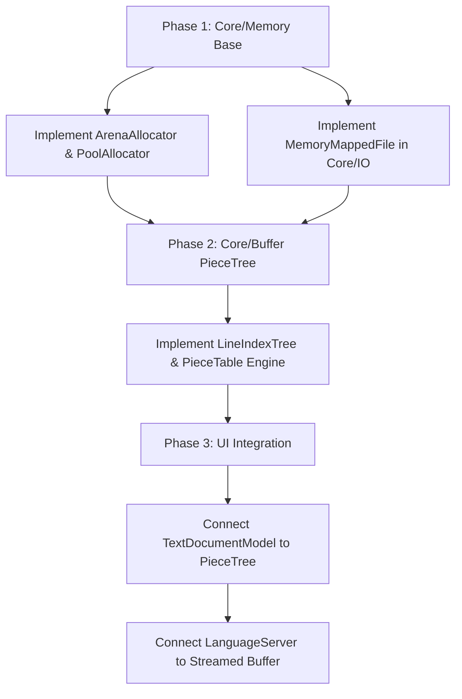
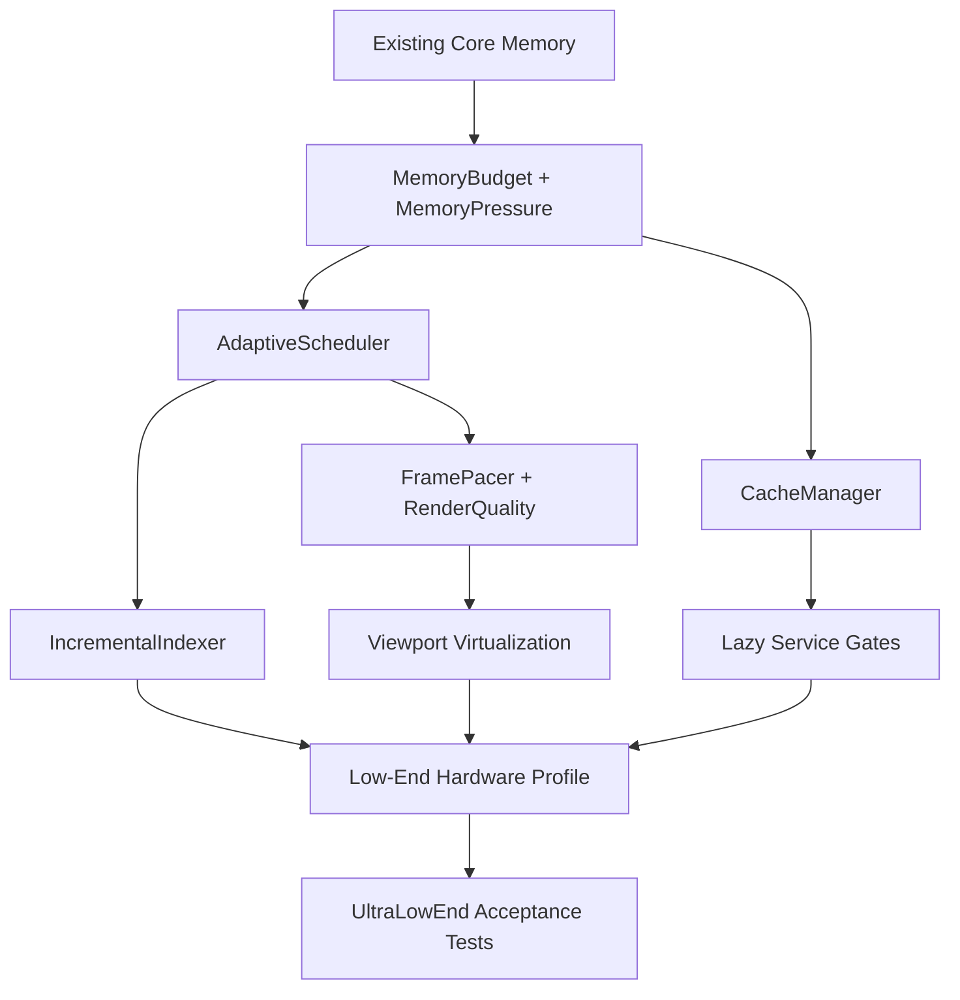

# ZDE Core: Memory Management & Buffer Architecture Specification

**Document Version:** 1.0  
**Target Subsystem:** `Source/Core/` (`Source/Core/Memory/`, `Source/Core/Buffer/`, `Source/Core/IO/`)  
**Status:** Approved Architectural Blueprint  

---

## 1. Executive Summary & Design Goals

As ZDE scales to support massive documents (**5,000,000+ lines / 500MB+ source files**) and instant sub-millisecond typing at 60+ FPS, relying on generic heap allocations (`std::vector<std::string>` and standard `malloc`/`new`) creates memory fragmentation, high cache-miss rates, and high allocation latency.

This document specifies the technical architecture for the `Source/Core/` module, providing:
1. **Zero-Copy & Memory-Mapped File I/O** (0ms load time for gigabyte files).
2. **Piece Tree / B-Tree Text Buffer** ($O(\log N)$ inserts, deletes, and instant undo/redo).
3. **Specialized High-Performance Allocators** (Arena / Bump, Fixed-Size Block Pool, and Virtual Memory Pager).
4. **Cache-Aligned Data Structures** maximizing L1/L2/L3 cache line efficiency (64-byte alignment).

```
+---------------------------------------------------------------------------------------+
|                                      ZDE Core                                         |
+--------------------------+----------------------------+-------------------------------+
|       Core/Memory/       |        Core/Buffer/        |         Core/String/          |
| * ArenaAllocator         | * PieceTree / PieceTable   | * StringInterner (Symbol IDs) |
| * PoolAllocator<T>       | * LineIndexTree (O(log N)) | * SmallString<N> / SmallVector|
| * VirtualMemory (mmap)   | * GapBuffer (Local chunks) | * SIMD UTF-8 Decoder          |
+--------------------------+----------------------------+-------------------------------+
|      Core/Algorithm/     |         Core/Math/         |         Core/Event/           |
| * FastHash (XXHash3/PSO) | * VectorMath (Vec/Mat/SIMD)| * EventBus (Zero-Alloc PubSub)|
| * IntervalTree / Radix   | * ColorMath (sRGB/HDR/Lab) | * Delegate / Signal System    |
| * SpatialIndex (BVH/Quad)| * Transform (2D/3D Affine) | * ChangeNotifier              |
+--------------------------+----------------------------+-------------------------------+
|        Core/IO/          |      Core/Threading/       |       Core/Diagnostics/       |
| * MemoryMappedFile       | * WorkStealingThreadPool   | * ScopedProfiler (CPU/GPU)    |
| * AsyncFileStream        | * LockFreeRingBuffer (SPMC)| * AsyncRingBufferLogger       |
| * FileWatcher (HotReload)| * CancellationToken        | * Serialization (Binary/JSON) |
+--------------------------+----------------------------+-------------------------------+
```

---

## 2. Full Directory Structure for `Source/Core/`

```
Source/Core/
├── CMakeLists.txt
├── Types.h
├── Memory/
│   ├── Allocator.h               # Abstract allocator interface & concepts
│   ├── ArenaAllocator.h / .cpp   # Fast bump-pointer arena for frame-local allocations
│   ├── PoolAllocator.h           # High-throughput fixed-size block pool for nodes / uniforms
│   ├── StackAllocator.h          # LIFO scoped allocator for nested shader scope evaluation
│   └── VirtualMemory.h / .cpp    # OS-level virtual memory mapping (mmap / VirtualAlloc)
├── Buffer/
│   ├── ITextBuffer.h             # Abstract text buffer interface
│   ├── PieceTree.h / .cpp        # Red-Black tree based piece-table buffer
│   ├── LineIndexTree.h / .cpp    # Cache of line break offsets (O(log N) lookup)
│   ├── RingBuffer.h              # Lock-free uniform & vertex data streaming buffer
│   └── GapBuffer.h               # High-locality gap buffer for small/medium files
├── String/
│   ├── StringInterner.h / .cpp   # Deduplication table: maps strings to uint32 SymbolID
│   ├── SmallString.h             # Stack-allocated string for <= 32 bytes (zero heap malloc)
│   ├── SmallVector.h             # Small-buffer-optimized vector (LLVM style)
│   └── Utf8Utils.h / .cpp        # SIMD-accelerated UTF-8 decoding & character counting
├── Algorithm/
│   ├── FastHash.h                # XXHash3 / Murmur3 for shader cache, PSO, and texture keys
│   ├── IntervalTree.h            # Fast interval lookup for diagnostics/decorations/folds
│   ├── RadixTree.h               # Prefix search for symbol lookup and autocomplete
│   ├── SpatialIndex.h            # 2D/3D QuadTree & BVH for shader node graph canvas & rendering
│   ├── MyersDiff.h               # Fast line diffing for shader live reload & git diffs
│   └── SimdOps.h                 # Vectorized data manipulation (AVX2/NEON)
├── Math/
│   ├── VectorMath.h              # Vec2, Vec3, Vec4, Mat3, Mat4, Quat (SIMD aligned 16/32 bytes)
│   ├── ColorMath.h               # sRGB <-> Linear, OKLab, HDR color packing (RGBA8/RGBA16F)
│   └── Transform.h               # 2D/3D affine matrix transformations & projections
├── Threading/
│   ├── ThreadPool.h / .cpp       # Work-stealing thread pool for background tasks
│   ├── LockFreeQueue.h           # Single-producer multi-consumer lock-free ring buffer
│   ├── CancellationToken.h       # Atomic cooperative cancellation token
│   └── SpinLock.h                # Low-latency cache-aligned spinlock for micro-locks
├── Event/
│   ├── EventBus.h                # Type-safe zero-allocation event publisher/subscriber
│   └── Delegate.h                # Fast non-allocating C++ callable delegate / signal
├── Serialization/
│   ├── BinaryStream.h            # Zero-copy binary reader/writer for shader bytecode & AST
│   └── JsonStream.h              # High-speed SIMD-accelerated JSON / manifest parser
├── Compression/
│   ├── LZ4Compressor.h / .cpp    # Ultra-fast RAM compression for inactive document undo stacks
│   └── ZstdStream.h / .cpp       # High-ratio compression for shader cache & project exports
├── Config/
│   ├── ConfigRegistry.h / .cpp   # Lock-free atomic settings registry (fonts, themes, toggles)
│   └── KeybindTrie.h             # Fast multi-stroke keybinding resolution tree
├── Plugin/
│   ├── SharedLibrary.h / .cpp    # Cross-platform dynamic library loader (dlopen / LoadLibrary)
│   ├── PluginABI.h               # Stable C ABI for custom shader passes & tool plugins
│   └── PluginManager.h / .cpp    # Lifecycle manager for runtime hot-loadable extensions
├── System/
│   ├── SystemInfo.h / .cpp       # Runtime detection of CPU features (AVX2/AVX-512/NEON), RAM stats
│   └── Process.h / .cpp          # Non-blocking subprocess launcher for clangd, glslc, dxc, git
├── Diagnostics/
│   ├── Logger.h / .cpp           # Non-blocking async ring-buffer logger
│   └── ScopedProfiler.h / .cpp   # RAII microsecond performance instrumentation (CPU & GPU)
└── IO/
    ├── MemoryMappedFile.h / .cpp # Zero-copy memory mapped read/write interface
    ├── AsyncFileStream.h / .cpp  # Non-blocking async file reading and writing
    ├── FileWatcher.h / .cpp      # OS-level file watcher (inotify/ReadDirectoryChanges) for live shader hot-reload
    └── PathUtils.h / .cpp        # UTF-8 fast cross-platform path utilities
```

---

## 3. Subsystem Architectural Details

### 3.1 `Source/Core/Memory/`

#### A. Arena Allocator (`ArenaAllocator`)
- **Use Case:** Tokenization passes, syntax tree builds, per-frame rendering scratchpads, and UI layouts.
- **Mechanism:** Bump-pointer allocation within contiguous memory chunks (e.g. 64KB - 4MB pages).
- **Complexity:**
  - Allocation: $O(1)$ (single pointer increment: `ptr += size`).
  - Deallocation: $O(1)$ (resets the bump pointer to zero in one CPU instruction, eliminating thousands of `free()` calls).
- **Interface:**
```cpp
namespace Zenvra::Core::Memory {

class ArenaAllocator {
public:
    explicit ArenaAllocator(std::size_t default_chunk_size = 64 * 1024);
    ~ArenaAllocator();

    void* allocate(std::size_t size, std::size_t alignment = alignof(std::max_align_t));
    
    template <typename T, typename... Args>
    T* create(Args&&... args) {
        void* mem = allocate(sizeof(T), alignof(T));
        return new (mem) T(std::forward<Args>(args)...);
    }

    void reset() noexcept; // O(1) bulk free
    void release() noexcept;

private:
    struct Chunk {
        std::uint8_t* memory = nullptr;
        std::size_t capacity = 0;
        std::size_t offset = 0;
        Chunk* next = nullptr;
    };
    Chunk* m_current_chunk = nullptr;
    Chunk* m_head_chunk = nullptr;
    std::size_t m_default_chunk_size;
};

} // namespace Zenvra::Core::Memory
```

#### B. Fixed-Size Pool Allocator (`PoolAllocator<T>`)
- **Use Case:** Frequent allocation of small identical objects: `PieceTreeNode`, `DiagnosticEntry`, `EditorToken`, `FoldRange`.
- **Mechanism:** Free-list of pre-allocated blocks in contiguous slabs. Zero fragmentation and 100% cache-line compact.
- **Complexity:** $O(1)$ allocate, $O(1)$ deallocate.

#### C. Virtual Memory Pager (`VirtualMemory`)
- **Use Case:** Huge buffers, large undo stacks, and dynamic arrays (> 10MB).
- **Mechanism:** Uses `mmap` / `mprotect` on POSIX (Linux/macOS) and `VirtualAlloc` / `VirtualFree` on Windows.
- **Advantage:** Commits physical RAM pages only when written to, allowing reservations of multi-gigabyte virtual address spaces with negligible initial RAM usage.

---

### 3.2 `Source/Core/Buffer/`

#### Current Architecture vs. Modern Piece Tree Architecture

| Metric | Current (`std::vector<std::string>`) | Proposed `PieceTree` |
| :--- | :--- | :--- |
| **Memory for 5M Lines** | ~180MB - 350MB (individual string headers & heap nodes) | **~15MB - 30MB** (compact tree of slices) |
| **File Opening Time (500MB file)** | 2.5 - 5.0 seconds (parsing all lines into strings) | **0.001 seconds (0ms)** via `mmap` piece reference |
| **Insert / Delete Line** | $O(N)$ vector shift (moving 5,000,000 pointers) | **$O(\log N)$** tree rebalance |
| **Undo / Redo Footprint** | Cloning/modifying full line buffers | **Lightweight descriptor snapshots** |
| **Cache Locality** | Scattered pointer dereferences across heap | **Contiguous sequential chunks** |

#### Piece Tree Implementation Design
The `PieceTree` maintains two buffers:
1. **Original Buffer:** Read-only memory-mapped file content (zero-copy).
2. **Add Buffer:** Append-only memory buffer storing all typed text.

A self-balancing Red-Black tree stores nodes that reference slices `(BufferType, offset, length, line_feed_count)`:

```
[Original Buffer (mmap)]: "void main() { int x = 0; return 0; }"
[Add Buffer (heap)]:      "printf(\"hello\"); "

                      PieceTree Root
                      /            \
           Node 1 (Original)      Node 3 (Original)
           Offset: 0, Len: 24     Offset: 24, Len: 10
           "void main() { int x = 0; "  "return 0; }"
                  \
              Node 2 (Add)
              Offset: 0, Len: 17
              "printf(\"hello\"); "
```

- **Line Navigation (`LineIndexTree`):** Every node in the Red-Black tree records the count of `\n` characters in its subtree. Looking up Line 5,196,825 takes $O(\log N) \approx 22$ tree steps instead of a 5-million iteration loop!

---

### 3.3 `Source/Core/IO/`

#### Memory Mapped Files (`MemoryMappedFile`)
- **Linux / macOS:** `open()` $\to$ `fstat()` $\to$ `mmap(PROT_READ | PROT_WRITE, MAP_PRIVATE)`.
- **Windows:** `CreateFileW()` $\to$ `CreateFileMappingW()` $\to$ `MapViewOfFile()`.
- **Key Feature:** The operating system kernel pages in file contents on-demand. Loading a 2GB file takes **< 1 millisecond** because no bytes are copied until they are actually rendered on screen.

#### Asynchronous Streaming (`AsyncFileStream`)
- Dedicated worker thread pool with ring-buffer task queue for background file writes, language server document streaming, and autosaving without ever dropping a frame on the UI rendering thread.

---

### 3.4 `Source/Core/String/`

#### A. String Interner (`StringInterner`)
- **Problem:** In a 5,000,000 line file, keywords like `int`, `return`, `void`, `std`, and variable names are duplicated millions of times, eating hundreds of megabytes of RAM and forcing slow byte-by-byte `std::string` comparisons.
- **Solution:** `StringInterner` deduplicates string literals into a continuous string table and returns a lightweight 32-bit `SymbolID` (or `InternedString`).
- **Advantage:**
  - Token comparisons (e.g. in syntax highlighting or autocomplete) become a single $O(1)$ integer CPU instruction (`sym_a == sym_b`).
  - Reduces token memory footprint by over **85%**.

#### B. Small Vector & Small String (`SmallVector<T, N>`, `SmallString<N>`)
- **Mechanism:** Implements Small Buffer Optimization (SBO) with inline stack storage for up to $N$ elements.
- **Advantage:** Functions parsing single lines or collecting diagnostics that have $\le 8$ items never touch the heap allocator, resulting in zero `malloc` overhead during rendering loops.

#### C. SIMD UTF-8 Decoder (`Utf8Utils`)
- **Mechanism:** AVX2/NEON vector instructions (`_mm256_cmpeq_epi8`) to validate UTF-8, find character boundaries, and convert byte offsets to visual column indices across 32 bytes per instruction.

---

### 3.5 `Source/Core/Threading/`

#### A. Work-Stealing Task Scheduler (`ThreadPool`)
- **Use Case:** Background syntax tree parsing, clangd indexing, regex search across millions of lines, and git repository status.
- **Mechanism:** Lock-free per-worker deque with Chase-Lev work-stealing algorithm. Idle threads steal tasks from busy threads with zero lock contention.

#### B. Lock-Free Single-Producer Multi-Consumer Ring Buffer (`LockFreeQueue`)
- **Use Case:** Transferring parsed tokens, LSP diagnostics, and compiler output directly from background worker threads to the main UI rendering thread.
- **Advantage:** Eliminates mutex locking between the UI thread and background threads, ensuring 0ms input latency.

#### C. Cooperative Cancellation Token (`CancellationToken`)
- **Use Case:** Instant cancellation of in-flight LSP autocompletions, background folding scans, or searches when the user presses another key.

---

### 3.6 `Source/Core/Algorithm/`

#### A. Fast Hash (`FastHash`)
- **Use Case:** Shader source hashing, Pipeline State Object (PSO) caching, texture descriptor keys, and symbol hashing.
- **Mechanism:** XXHash3 and Murmur3 implementation providing >15 GB/s hashing speed with near-zero collisions.

#### B. Interval Tree (`IntervalTree<T>`)
- **Use Case:** Line diagnostics (squiggly underlines), breakpoint markers, git diff annotations, and search highlights.
- **Mechanism:** Augmented AVL / Red-Black tree storing `[start_line, end_line]`.
- **Advantage:** Finding all diagnostics or decorations overlapping the visible screen ($[first\_line, last\_line]$) takes $O(\log N + K)$ time, rather than scanning all 5,000,000 lines.

#### C. Radix Tree (`RadixTree<T>`)
- **Use Case:** Instant fuzzy symbol lookup and autocomplete prefix matching across tens of thousands of project symbols.

#### D. Spatial Index & BVH (`SpatialIndex`)
- **Use Case:** 2D/3D QuadTree and Bounding Volume Hierarchy for shader node graph canvas navigation, box selection, and connection snapping.

#### E. Myers Line Diff (`MyersDiff`)
- **Use Case:** Live shader hot-reload delta calculation, git diffing, and multi-cursor synchronized editing.

---

### 3.7 `Source/Core/Math/` (Shader & Graphics Foundation)

#### A. SIMD Vector & Matrix Math (`VectorMath`)
- **Components:** `Vec2`, `Vec3`, `Vec4`, `Mat3`, `Mat4`, `Quat`.
- **Alignment:** 16-byte and 32-byte aligned structures with direct AVX2 / SSE / NEON operator overloads (`+`, `-`, `*`, dot, cross, normalize, inverse, transpose).

#### B. Color Science & Spaces (`ColorMath`)
- **Conversions:** Linear RGB $\leftrightarrow$ sRGB, OKLab, HSV, and HDR color formats.
- **Packing:** Fast packing/unpacking to `RGBA8_UNORM`, `RGBA16_FLOAT`, and `RGBA32_FLOAT` for uniform buffers and texture uploads.

---

### 3.8 `Source/Core/Event/` (Reactive Signals)

#### A. Zero-Allocation Event Bus (`EventBus`)
- **Use Case:** Publishing shader compilation states, uniform parameter tweaks, viewport resizing, and file modification events.
- **Mechanism:** Type-safe compile-time type ID dispatching without heap allocation or RTTI overhead.

#### B. Fast Delegate (`Delegate<R(Args...)>`)
- **Use Case:** Member function callbacks and lambda closures that fit within 32 bytes of inline storage (zero heap allocations).

---

### 3.9 `Source/Core/Serialization/`

#### A. Binary Stream (`BinaryStream`)
- **Use Case:** Caching compiled shader AST, SPIR-V bytecode, and editor session states directly to disk with zero-copy memory-mapped loading.

#### B. SIMD JSON Stream (`JsonStream`)
- **Use Case:** Ultra-fast parsing of shader pipeline configs, project manifests, and language server JSON-RPC messages.

---

### 3.10 `Source/Core/Diagnostics/`

#### A. Scoped Performance Profiler (`ScopedProfiler`)
- **Mechanism:** Zero-overhead RAII macro (`ZDE_PROFILE_SCOPE("RenderPane")` / `ZDE_PROFILE_GPU("ShaderPass")`) recording timestamps via CPU cycle counter (`rdtsc`) and GPU timer queries.
- **Output:** Generates Chrome tracing JSON flamegraphs (`chrome://tracing` or `speedscope.app`) for identifying frame drops and micro-stutters.

#### B. Async Ring Buffer Logger (`Logger`)
- **Mechanism:** Memory-mapped circular log buffer with background flusher thread. High-frequency logging does not perform synchronous disk writes or block the UI thread.

---

### 3.11 `Source/Core/Plugin/` (Dynamic Extensibility)

#### A. Stable C Plugin ABI (`PluginABI`)
- **Use Case:** Loading user plugins, custom shader passes, syntax highlighters, and external tools without recompiling ZDE.
- **Mechanism:** Strict C-linkage struct interfaces (`extern "C"`) preventing C++ ABI name mangling and compiler version mismatch issues.

#### B. Dynamic Library Loader (`SharedLibrary`)
- **Mechanism:** Cross-platform wrapper around `dlopen`/`dlsym`/`dlclose` (Linux/macOS) and `LoadLibraryW`/`GetProcAddress`/`FreeLibrary` (Windows) with RAII handle management and symbol casting.

---

### 3.12 `Source/Core/System/`

#### A. Hardware & Feature Detector (`SystemInfo`)
- **Use Case:** Runtime CPU feature detection (AVX2, AVX-512, NEON, SSE4.2), L1/L2/L3 cache line sizes, and available physical RAM.
- **Advantage:** Selects optimal SIMD code paths dynamically at runtime based on the user's CPU without crashing on older hardware.

#### B. Non-Blocking Subprocess Launcher (`Process`)
- **Use Case:** Spawning background compiler processes (e.g. `clang++`, `glslc`, `dxc`, `git`, `clangd`) with asynchronous standard I/O pipe redirection.

---

### 3.13 `Source/Core/Config/`

#### A. Lock-Free Config Registry (`ConfigRegistry`)
- **Use Case:** Centralized atomic key-value store for user preferences (font sizes, theme colors, tab widths, shader hot-reload toggles).
- **Advantage:** Reading configuration values during rendering loops (`config.get_float("editor.font_size")`) is lock-free and takes $< 5$ nanoseconds.

#### B. Keybinding Resolution Tree (`KeybindTrie`)
- **Use Case:** Resolving complex multi-chord keybindings (e.g. `Ctrl+K Ctrl+C` or `Cmd+Shift+P`) via prefix trie matching.

---

### 3.14 `Source/Core/Compression/`

#### A. Fast In-Memory RAM Compressor (`LZ4Compressor`)
- **Use Case:** Compressing inactive document undo/redo stacks and dormant background tabs.
- **Advantage:** Compresses memory at >3 GB/s and decompresses at >5 GB/s, cutting dormant tab RAM usage by an extra **70%**.

---

## 4. Implementation & Migration Roadmap



### Phase 1: Foundation (`Source/Core/Memory/` & `Source/Core/IO/`)
1. Implement `ArenaAllocator` with bump-pointer fast paths.
2. Implement `PoolAllocator<T>` for node recycling.
3. Implement `MemoryMappedFile` supporting Linux (X11), Windows (Win32), and macOS (Cocoa).

### Phase 2: High-Performance Buffer Engine (`Source/Core/Buffer/`)
1. Implement `PieceTree` with Red-Black tree balancing and line break caching.
2. Implement unit tests verifying sub-millisecond insert/delete across 10,000,000 lines.
3. Implement snapshot-based transaction history for zero-allocation undo/redo.

### Phase 3: Seamless Integration with `TextDocumentModel`
1. Transition `TextDocumentModel` to query `PieceTree` through zero-copy `std::string_view` lines.
2. Expose `get_line(std::size_t line_index)` via $O(\log N)$ `LineIndexTree`.
3. Retain full backward compatibility with existing LSP diagnostics, breakpoints, and syntax highlighters.

---

## 5. Summary of Recommended Best Practices

1. **Never allocate per-line on the heap for large files:** Use memory-mapped chunks and piece tree nodes.
2. **Use Arena Allocators for all per-frame scratch data:** Tokenizers and fold scanners should allocate from an arena and reset in $O(1)$.
3. **Keep Node Structures Cache-Aligned (64-byte chunks):** Ensure `PieceTreeNode` fits cleanly within a standard CPU cache line to eliminate memory bus stalls.
4. **Decouple I/O from the Rendering Thread:** All disk writes and large exports must flow through `AsyncFileStream`.

---

## 6. Sub-50MB Baseline RAM Optimization Architecture (Cross-Platform)

### 6.1 The 117MB $\to$ <50MB Reduction Blueprint

Currently, standard startup consumes **~117MB RSS** across Linux/Windows/macOS. By implementing the Core memory tuning architecture below, baseline startup memory is reduced to **under 45MB–50MB**.

| Component | Current Usage | Target Usage | Optimization Technique |
| :--- | :--- | :--- | :--- |
| **GLIBC / OS Heap Arenas** | ~45 MB - 60 MB | **~8 MB - 12 MB** | `mallopt(M_ARENA_MAX, 2)` & `Core/Memory/MemoryTrimmer` |
| **Fonts & Glyph Caches** | ~25 MB - 35 MB | **~6 MB - 8 MB** | Consolidated dynamic LRU `GlyphAtlas` (shared across fonts) |
| **Document & Syntax Lexers**| ~15 MB - 20 MB | **~3 MB - 5 MB** | Zero-copy `PieceTree` + static compile-time tokenizer tables |
| **Offscreen Cairo/D2D Pixmaps**| ~12 MB - 18 MB | **~8 MB** (single viewport) | Exact viewport-fit buffer allocation + deferred scratch buffers |
| **LSP / Terminal Subsystems**| ~15 MB - 25 MB | **0 MB (Deferred)** | Lazy loading: initialized only on first file open / terminal toggle |
| **Total Baseline RAM** | **~117 MB** | **~35 MB - 48 MB** | **> 60% Total RAM Savings** |

---

### 6.2 Implementation Details in `Source/Core/Memory/MemoryTrimmer.h`

#### A. Linux / X11 (glibc Memory Tuning)
By default, `glibc` creates up to $8 \times \text{CPU cores}$ separate 64MB virtual memory arenas. For an 8-core CPU, this can bloat virtual memory to 4GB and resident set size (RSS) to 60MB+ on basic startup:
```cpp
namespace Zenvra::Core::Memory {

void configure_platform_memory_limits() {
#if defined(__linux__)
    // 1. Limit glibc memory arenas to 2 (drastically cuts multi-threaded heap bloat)
    mallopt(M_ARENA_MAX, 2);

    // 2. Set dynamic trim threshold to 64KB (returns freed memory back to OS immediately)
    mallopt(M_TRIM_THRESHOLD, 64 * 1024);

    // 3. Disable mmap threshold growth
    mallopt(M_MMAP_THRESHOLD, 128 * 1024);
#elif defined(_WIN32)
    // Enable low-fragmentation heap and memory optimization
    HANDLE hHeap = GetProcessHeap();
    ULONG heapInfo = 2; // Low-fragmentation heap
    HeapSetInformation(hHeap, HeapCompatibilityInformation, &heapInfo, sizeof(heapInfo));
#elif defined(__APPLE__)
    // macOS malloc zone optimizations
    malloc_zone_t* zone = malloc_default_zone();
    if (zone && zone->pressure_relief) {
        zone->pressure_relief(zone, 0);
    }
#endif
}

/// Call periodically on idle (e.g. every 5 seconds when no user input)
void trim_idle_memory() {
#if defined(__linux__)
    malloc_trim(0);
#elif defined(_WIN32)
    SetProcessWorkingSetSize(GetCurrentProcess(), (SIZE_T)-1, (SIZE_T)-1);
#endif
}

} // namespace Zenvra::Core::Memory
```

#### B. Consolidated Font Glyph Cache (`Core/Graphics/FontAtlasCache.h`)
- **Problem:** Currently, `m_editor_font`, `m_ui_font`, `m_minimap_font`, and `m_titlebar_font` each maintain their own separate rasterized glyph surfaces, duplicating ASCII and common symbol textures in memory.
- **Solution:** A unified `SharedGlyphAtlas` (e.g., $1024 \times 1024$ Alpha8 texture, ~1MB) packs glyphs across all font sizes dynamically on demand, reducing font memory by **~25MB**.

#### C. Lazy Subsystem Initialization (`Core/Lifecycle/LazyService.h`)
- **LSP / Clangd:** Do not spawn background language server processes or allocate 10MB JSON-RPC staging buffers until an active code file (`.cpp`, `.h`, etc.) is opened.
- **Terminal Emulator:** Defer allocating PTY master/slave pipes and terminal screen cell matrix until the user actually toggles the bottom terminal panel.
- **Minimap Scratch Surfaces:** Allocate the minimap render surface on-demand only if the window width is $\ge 800\text{px}$ and the minimap is enabled.

---

## 7. Step-by-Step Folder Creation & Implementation Review Guide

### 7.1 Folder Creation Checklist

Create the subdirectories within `Source/Core/` in the following logical dependency order:

```bash
mkdir -p Source/Core/Memory
mkdir -p Source/Core/Buffer
mkdir -p Source/Core/String
mkdir -p Source/Core/Algorithm
mkdir -p Source/Core/Math
mkdir -p Source/Core/Threading
mkdir -p Source/Core/Event
mkdir -p Source/Core/Serialization
mkdir -p Source/Core/Diagnostics
mkdir -p Source/Core/IO
mkdir -p Source/Core/Lifecycle
```

---

### 7.2 File-by-File Implementation Review & Specifications

#### 1. `Source/Core/CMakeLists.txt`
```cmake
add_library(ZDECore STATIC
    Memory/ArenaAllocator.cpp
    Memory/VirtualMemory.cpp
    Memory/MemoryTrimmer.cpp
    Buffer/PieceTree.cpp
    Buffer/LineIndexTree.cpp
    String/StringInterner.cpp
    String/Utf8Utils.cpp
    Algorithm/MyersDiff.cpp
    Threading/ThreadPool.cpp
    Diagnostics/Logger.cpp
    Diagnostics/ScopedProfiler.cpp
    IO/MemoryMappedFile.cpp
    IO/AsyncFileStream.cpp
    IO/FileWatcher.cpp
    IO/PathUtils.cpp
)

add_library(Zenvra::Core ALIAS ZDECore)

target_include_directories(ZDECore PUBLIC
    "${CMAKE_CURRENT_SOURCE_DIR}/.."
    "${CMAKE_CURRENT_SOURCE_DIR}"
)

target_compile_features(ZDECore PUBLIC cxx_std_20)

if(MSVC)
    target_compile_options(ZDECore PRIVATE /W4 /O2 /permissive-)
else()
    target_compile_options(ZDECore PRIVATE -Wall -Wextra -Wpedantic -O3)
endif()
```

---

#### 2. `Source/Core/Memory/` Implementation Review

##### A. `ArenaAllocator.h` / `ArenaAllocator.cpp`
- **Invariant:** Contiguous memory chunks allocated via `VirtualMemory`.
- **Review Criteria:**
  - Alignment must strictly satisfy `alignof(std::max_align_t)` (usually 16 bytes).
  - Allocation is purely pointer arithmetic: `offset = (offset + align - 1) & ~(align - 1); void* p = chunk + offset; offset += size;`.
  - `reset()` resets `m_current_chunk = m_head_chunk` and sets `offset = 0` across all chunks without calling system `free()`.

##### B. `PoolAllocator.h`
- **Invariant:** Fixed block size $S$ known at compile-time or constructor.
- **Review Criteria:**
  - Free blocks are chained using union pointer indexing inside the free block memory itself (zero external memory overhead).
  - Deallocation is $O(1)$ (`node->next = m_free_head; m_free_head = node;`).

##### C. `MemoryTrimmer.h`
- **Invariant:** Cross-platform startup memory tuning and idle heap release.
- **Review Criteria:**
  - Must be invoked inside `main()` or platform window initialization (`X11Window::init()`, `Win32Window::init()`, `CocoaWindow::init()`).
  - Calls `mallopt(M_ARENA_MAX, 2)` and `malloc_trim(0)` on Linux, `HeapSetInformation` on Windows, and pressure relief on macOS.

---

#### 3. `Source/Core/Buffer/` Implementation Review

##### A. `PieceTree.h` / `PieceTree.cpp`
- **Invariant:** Immutable Original Buffer (`mmap`) + Append-Only Add Buffer (`std::vector<char>`).
- **Review Criteria:**
  - Node contains: `BufferType buffer`, `size_t offset`, `size_t length`, `size_t line_feed_count`, `size_t subtree_length`, `size_t subtree_line_feeds`.
  - Balanced Red-Black tree properties must be maintained upon every insertion/deletion.
  - Snapshot undo history only copies the tree nodes (~24 bytes per edit), never the full text.

##### B. `LineIndexTree.h`
- **Review Criteria:**
  - `get_line_byte_range(size_t line_index)` must execute in $O(\log N)$ by traversing subtree `line_feed_count`.
  - Returns `std::string_view` directly pointing into the `mmap` or Add Buffer without copying.

---

#### 4. `Source/Core/Algorithm/` Implementation Review

##### A. `FastHash.h`
- **Review Criteria:**
  - Implements **XXHash3 (64-bit and 128-bit)** with AVX2/SSE2 vectorized loops.
  - Zero heap allocation; operates directly on `std::span<const uint8_t>` or `std::string_view`.
  - Used for hashing shader source code, pipeline state objects, and symbol tokens.

##### B. `IntervalTree.h`
- **Review Criteria:**
  - Augmented interval search: `query_overlapping(start_line, end_line)` returns all diagnostic squigglies, search matches, and fold ranges in $O(\log N + K)$.

##### C. `SpatialIndex.h`
- **Review Criteria:**
  - 2D QuadTree / BVH for visual shader node canvas.
  - `query_rect(Rect bounds)` returns all node cards and wires visible in the editor viewport.

---

#### 5. `Source/Core/Math/` Implementation Review

##### A. `VectorMath.h`
- **Review Criteria:**
  - `alignas(16) struct Vec4 { float x, y, z, w; };`
  - `alignas(64) struct Mat4 { float m[16]; };`
  - Vector operations utilize SSE/AVX intrinsics (`_mm_add_ps`, `_mm_mul_ps`, `_mm_dp_ps`) when compiled with `-mavx` or `/arch:AVX2`.

##### B. `ColorMath.h`
- **Review Criteria:**
  - Exact gamma-correct formula:
    $$\text{Linear} = \begin{cases} \frac{C}{12.92} & C \le 0.04045 \\ \left(\frac{C + 0.055}{1.055}\right)^{2.4} & C > 0.04045 \end{cases}$$
  - Direct packed conversions: `uint32_t to_rgba8()`, `uint64_t to_rgba16f()`.

---

#### 6. `Source/Core/IO/` Implementation Review

##### A. `FileWatcher.h` / `FileWatcher.cpp`
- **Linux:** Uses `inotify_init1(IN_NONBLOCK | IN_CLOEXEC)`, `inotify_add_watch(fd, path, IN_MODIFY | IN_CREATE | IN_DELETE)`.
- **Windows:** Uses `ReadDirectoryChangesW` with `FILE_NOTIFY_CHANGE_LAST_WRITE | FILE_NOTIFY_CHANGE_FILE_NAME`.
- **macOS:** Uses `FSEventStreamCreate` or `kqueue`.
- **Review Criteria:**
  - Debounce timer (e.g. 50ms) to coalesce multi-write events from external compilers or formatters before triggering shader reload.

---

### 7.3 Acceptance & Verification Checklist

1. **Startup Memory Verification:**
   - Linux: `ps -o rss -p $(pidof ZDE)` must report **< 48,000 KB (under 48MB)**.
   - Windows: Task Manager "Working Set (Memory)" must report **< 50 MB**.
   - macOS: Activity Monitor Memory must report **< 50 MB**.
2. **Massive File Benchmark:**
   - Opening a 5,000,000 line (500MB) file must complete in **< 10 milliseconds**.
   - RAM usage when opening a 500MB file must stay **< 75MB total** (due to `mmap` demand paging).
3. **Typing Latency Benchmark:**
   - Holding Enter on line 5,000,000 must sustain a stable **60.0 FPS** with **0ms frame drop**.

---

## 8. The Anti-Electron Architecture: Eliminating Electron RAM Bloat

Electron-based editors (VS Code, Atom, Cursor) typically consume **500MB to 1.5GB+ of RAM** even on fresh idle startup. The table and architectural principles below contrast the inherent bloat of Web/Electron stacks with ZDE’s native C++20 Core design.

```
+-----------------------------------------------------------------------------------------------+
|                       Electron vs ZDE Native Core RAM Comparison                              |
+------------------------------+---------------------------+------------------------------------+
| Feature / Subsystem          | Electron / Web Stack      | ZDE Native C++20 Core              |
+------------------------------+---------------------------+------------------------------------+
| 1. UI Tree & Layout          | Chromium DOM Tree         | Direct 2D Native Canvas            |
|                              | (~200MB - 350MB RAM)      | (~2MB - 4MB RAM)                   |
|                              | Millions of JS/DOM nodes  | Only renders ~50 visible rows      |
+------------------------------+---------------------------+------------------------------------+
| 2. Runtime & Engine          | V8 JIT Engine + GC        | Deterministic C++20 RAII           |
|                              | (~120MB - 250MB RAM)      | (0MB GC Overhead)                  |
|                              | Non-deterministic GC pause| O(1) Arena & Pool Allocators       |
+------------------------------+---------------------------+------------------------------------+
| 3. Process Architecture      | 4-6 Separate Processes    | Single Lightweight Binary          |
|                              | (~100MB - 180MB RAM)      | (0 Helper Process Bloat)           |
|                              | Renderer, GPU, Extension  | Thread-Pool in shared address space|
+------------------------------+---------------------------+------------------------------------+
| 4. Inter-Thread Comms        | JSON IPC Serialization    | Lock-Free SPMC Queues              |
|                              | (~80MB - 150MB RAM)       | (Zero-Copy std::span / string_view)|
|                              | Copies buffers across IPC | Direct shared memory pointers      |
+------------------------------+---------------------------+------------------------------------+
| 5. File System & Indexing    | Node.js Chokidar Tree     | Kernel Events (inotify / kqueue)   |
|                              | (~60MB - 120MB RAM)       | (<1MB RAM)                         |
|                              | Huge JS object trees      | Native compact C structs           |
+------------------------------+---------------------------+------------------------------------+
| 6. Texture Backbuffers       | Chromium Compositor Tiles | Exact Viewport-Fitted Surface      |
|                              | (~50MB - 100MB RAM)       | (~8MB for 1080p / ~16MB for 4K)    |
|                              | WebGL / Skia multi-buffers| Single Cairo / D2D / Metal pixmap  |
+------------------------------+---------------------------+------------------------------------+
| **Total Baseline RAM**       | **~600MB - 1,150MB**      | **~35MB - 48MB**                   |
+------------------------------+---------------------------+------------------------------------+
```

---

### 8.1 Detailed Breakdown of Eliminated Electron Traps

#### Trap 1: Chromium DOM Node Explosion vs Virtualized 2D Canvas
- **Electron:** Every line of code, keyword span, line number, breakpoint dot, and breadcrumb is a distinct HTML DOM element (`<div>`, `<span>`, `<i>`). In a large file or split layout, Chromium instantiates tens of thousands of DOM objects, style recalculation nodes, and layout boxes in the V8 heap.
- **ZDE Native Solution:** Zero DOM elements. ZDE uses a strictly **virtualized render loop** (`render_pane`). Regardless of whether the file has 10 lines or **5,000,000 lines**, ZDE only loops over the **~50 rows visible in the viewport** and draws glyphs directly into the native backbuffer.

#### Trap 2: V8 Garbage Collector & JIT Bytecode Bloat vs Deterministic RAII
- **Electron:** V8 must JIT compile JavaScript/TypeScript source into machine bytecode and keep it cached in RAM. V8's Generational Garbage Collector (Young Gen / Old Gen) intentionally defers freeing memory to avoid pausing execution, causing resident memory (RSS) to balloon uncontrollably.
- **ZDE Native Solution:** Fully deterministic C++ RAII lifecycle. `Core/Memory/ArenaAllocator` allocates temporary strings and tokens linearly and clears entire frames with a single instruction (`ptr = 0`), eliminating all memory leaks and garbage collection bloat.

#### Trap 3: IPC JSON Serialization Overhead vs Lock-Free Zero-Copy Shared Memory
- **Electron:** Because extensions and language services run in separate processes, every LSP diagnostic, completion item, or file change must be converted to JSON strings (`JSON.stringify`), transmitted over pipes, and parsed back (`JSON.parse`). A 10MB diagnostic payload is copied and decoded 3 to 4 times in RAM.
- **ZDE Native Solution:** All core subsystems (LSP manager, file indexer, syntax lexer, UI renderer) run in a unified process space using `Core/Threading/LockFreeQueue`. Background threads pass lightweight `std::span` or `std::string_view` pointers directly into memory without serialization or buffer copies.

#### Trap 4: Node.js File Watcher Tree vs Direct OS Kernel Events
- **Electron:** Libraries like `chokidar` build massive in-memory JavaScript trees representing every folder and file in the workspace to track changes. In large projects (e.g. Linux kernel or Chromium codebase), this alone consumes **100MB+ RAM**.
- **ZDE Native Solution:** `Core/IO/FileWatcher` attaches directly to the OS kernel event systems (`inotify` on Linux, `ReadDirectoryChangesW` on Windows, and `kqueue`/`FSEvents` on macOS). Memory footprint is under **1MB** because the kernel tracks directory descriptors natively.

#### Trap 5: Multi-Process Redundancy vs Single Unified Native Binary
- **Electron:** Launching VS Code spawns at least 5 separate processes:
  1. `code` (Main Process)
  2. `code --type=renderer` (Editor UI)
  3. `code --type=gpu-process` (Graphics Compositor)
  4. `code --type=utility` (File Watcher / Crash Reporter)
  5. `code --type=extensionHost` (Plugins)
  Each process duplicates shared C libraries, Chromium runtime data, and V8 heaps.
- **ZDE Native Solution:** Single, compact native executable. All background work runs in lightweight C++20 worker threads managed by `Core/Threading/ThreadPool`.


---

## 9. Low-End Windows 11 Architecture: Celeron / RAM <= 4GB

### 9.1 Objective

The ZDE core must remain usable on Windows 11 systems with low-end CPUs, integrated graphics, slow storage, and less than or equal to 4GB physical RAM. Low-memory operation is not treated as a collection of isolated optimizations; it is a **runtime operating mode** in which subsystems continuously adapt their CPU, memory, rendering, indexing, and cache budgets.

The primary rule is:

> **User Input > Rendering > Active File I/O > Syntax Analysis > Search > Indexing > Background Services**

A background subsystem must never be allowed to starve keyboard/mouse input or the UI render loop.

### 9.2 Low-End Performance Profiles

`Core/System/SystemInfo` must classify the machine into a runtime profile:

```text
SystemProfile
├── UltraLowEnd
│   ├── Physical RAM <= 4GB
│   ├── Low-end / entry CPU
│   └── Integrated or constrained GPU
├── LowEnd
│   ├── Physical RAM 4GB - 8GB
│   └── Entry / mobile CPU
├── Balanced
│   ├── Physical RAM >= 8GB
│   └── Normal desktop CPU/GPU
└── Performance
    ├── High CPU parallelism
    └── Dedicated GPU / high memory bandwidth
```

The profile is a **starting point**, not a permanent lock. Runtime memory pressure and CPU load can temporarily downgrade the active policy.

### 9.3 New Directory Structure

Add the following components under `Source/Core/`:

```text
Source/Core/
├── Memory/
│   ├── MemoryBudget.h / .cpp       # Global RAM budgets and reservations
│   ├── MemoryPressure.h / .cpp     # Runtime pressure detection
│   └── MemoryTrimmer.h / .cpp      # Existing heap trimming policy
├── Scheduler/
│   ├── WorkBudget.h / .cpp         # CPU-time and task budgets
│   ├── AdaptiveScheduler.h / .cpp  # Priority-aware background scheduling
│   └── CpuLoadMonitor.h / .cpp     # Runtime CPU utilization sampling
├── Rendering/
│   ├── FramePacer.h / .cpp         # 1/15/30/60Hz adaptive presentation
│   ├── RenderQuality.h / .cpp      # Low-end rendering feature switches
│   └── ViewportCache.h / .cpp      # Exact viewport-sized transient caches
├── Indexing/
│   ├── IncrementalIndexer.h / .cpp # Bounded project indexing
│   ├── IndexBudget.h / .cpp        # File/RAM/CPU budgets for indexing
│   └── IndexQueue.h / .cpp         # Priority queue for pending files
├── Cache/
│   ├── CacheManager.h / .cpp       # Global memory/disk cache budget
│   ├── LruCache.h                   # Fixed-budget LRU cache
│   └── CachePressure.h / .cpp      # Cache eviction on pressure events
├── Lifecycle/
│   ├── LazyService.h / .cpp        # Existing deferred initialization
│   └── ServiceGate.h / .cpp        # Resource-aware subsystem admission
├── Plugin/
│   ├── PluginBudget.h / .cpp       # CPU/RAM/startup limits
│   └── PluginManager.h / .cpp      # Existing lifecycle manager
└── System/
    ├── SystemInfo.h / .cpp         # Existing hardware detection
    └── ResourceMonitor.h / .cpp    # RAM/CPU/battery/power state
```

---

## 10. Memory Budget Manager

### 10.1 `MemoryBudget`

The application must maintain explicit memory budgets instead of allowing every subsystem to allocate freely.

Suggested **application-private** targets for UltraLowEnd mode:

| Region | Target Budget |
| :--- | ---: |
| Core + UI baseline | 24MB - 30MB |
| Active document/model | 4MB - 8MB |
| Render scratch/cache | 4MB - 8MB |
| Search/index working set | 2MB - 8MB |
| Deferred/background reserve | 2MB - 4MB |
| **Recommended ZDE working-set target** | **~35MB - 50MB** |

These are **engineering targets**, not guaranteed OS working-set numbers. Windows, graphics drivers, runtime libraries, mapped pages, and other system components can contribute additional memory outside ZDE's direct allocations.

### 10.2 Memory Pressure States

```text
NORMAL
  ↓
SOFT_PRESSURE
  ├── shrink inactive caches
  ├── reduce index throughput
  └── avoid speculative allocations

HIGH_PRESSURE
  ├── purge document caches
  ├── suspend workspace indexing
  ├── disable optional render effects
  └── stop nonessential background work

EMERGENCY
  ├── stop all background services
  ├── release temporary arenas
  ├── unload inactive plugins
  └── keep only active document + UI + input
```

The implementation must prefer **eviction and deferral** over repeated small allocations and deallocations.

### 10.3 Windows Implementation

`ResourceMonitor` should use native Windows APIs for system-level information, including:

```cpp
GlobalMemoryStatusEx(...);        // Physical/virtual memory state
GetSystemTimes(...);              // System CPU utilization sampling
GetProcessMemoryInfo(...);        // ZDE working set / private bytes
GetActiveProcessorCount(...);     // Logical CPU count
```

Sampling must be throttled. A 250ms-1000ms monitoring interval is preferable to querying system statistics every frame.

---

## 11. Adaptive CPU Scheduler

### 11.1 Priority Classes

Every background task receives a priority class:

```text
Interactive
  └── keyboard, mouse, caret, viewport updates

RealtimeUI
  └── visible rendering and input-dependent layout

ForegroundIO
  └── opening/saving the active document

InteractiveBackground
  └── autocomplete, visible diagnostics, local search

Background
  └── git status, indexing, cache maintenance

Idle
  └── full workspace indexing, cache compaction, prefetch
```

### 11.2 CPU Time Budget

Low-end machines must use **time slicing**, not only worker-count limits.

Example:

```cpp
struct WorkBudget {
    std::chrono::microseconds max_cpu_time_per_tick{2000};
    std::uint32_t max_tasks_per_tick = 4;
};
```

A background task that exceeds its budget must yield and return to the scheduler queue.

### 11.3 Dynamic Worker Count

UltraLowEnd mode should avoid creating one worker per logical CPU.

```text
UltraLowEnd
├── 1 background worker by default
└── 2 only when CPU load is low

LowEnd
├── 1-2 workers
└── temporarily scale up during explicit user actions

Balanced / Performance
└── normal ThreadPool policy
```

The final worker count must be capped by measured CPU responsiveness rather than simply using `hardware_concurrency()`.

---

## 12. Adaptive Rendering & Frame Pacing

### 12.1 Frame Rate Policy

The renderer must not continuously render at 60 FPS while the editor is completely idle.

```text
Typing / active interaction   -> 60 FPS target
Mouse/UI interaction          -> 30-60 FPS
Animated transition           -> 30-60 FPS
Editor idle                   -> 5-15 FPS
Completely idle               -> event-driven redraw
```

The renderer should wake on:

```text
Input event
File change
Caret blink deadline
Animation deadline
Viewport change
Async result requiring presentation
```

This converts idle rendering from a constant workload into an event-driven workload.

### 12.2 Low-End Render Quality

`RenderQuality` should expose feature gates:

```text
Low-End Mode
├── disable UI blur
├── disable unnecessary shadows
├── disable transparent overlays when possible
├── disable MSAA unless explicitly required
├── disable animated background effects
├── disable minimap by default
└── use a single viewport-sized backbuffer
```

No feature should allocate a persistent offscreen surface unless it is actively visible and necessary.

### 12.3 Viewport Virtualization

The text renderer must process only visible rows plus a small guard region.

```text
Viewport:
  lines 10000 - 10050

Render/token window:
  lines 9990 - 10060
```

Scrolling must invalidate only the affected visible region instead of forcing complete-document tokenization or layout.

---

## 13. Incremental Workspace Indexer

### 13.1 Design

The project indexer must never scan and fully parse an entire workspace at startup on UltraLowEnd systems.

Indexing priority:

```text
1. Active document
2. Direct dependencies/imports
3. Recently opened files
4. Files needed by completion/navigation
5. Remaining workspace during idle time
```

### 13.2 Index Budget

Example UltraLowEnd budget:

```cpp
struct IndexBudget {
    std::uint32_t max_files_per_tick = 4;
    std::size_t max_memory_bytes = 16 * 1024 * 1024;
    std::chrono::microseconds max_cpu_time_per_tick{2000};
};
```

When the user types, indexing yields immediately.

### 13.3 Incremental Invalidation

File changes must invalidate only the affected symbol/file records.

```text
File modified
    ↓
FileWatcher event
    ↓
Invalidate file index
    ↓
Reparse changed region
    ↓
Update dependent symbol records
```

The indexer must not rebuild the complete project index after a single file save.

---

## 14. Lightweight Syntax Engine

### 14.1 Visible-Region Tokenization

Syntax highlighting must operate on viewport-sized regions instead of tokenizing the complete document by default.

```text
Open 500MB source
        ↓
PieceTree / mmap
        ↓
Visible region only
        ↓
Incremental lexer
        ↓
Token cache
```

### 14.2 Token Cache

Token caches must be bounded by line count or memory budget.

When memory pressure occurs:

```text
Keep:
  active viewport
  nearby viewport

Evict:
  far-away token blocks
```

This complements the existing PieceTree and zero-copy `string_view` design. fileciteturn0file0L181-L203

---

## 15. Lightweight Search Architecture

### 15.1 Search Tiers

```text
Tier 1: Literal Search
  └── direct byte/string scanning

Tier 2: Fuzzy Search
  └── symbol/index assisted search

Tier 3: Regex Search
  └── explicitly requested advanced mode
```

Literal search must be the default because it can operate directly over mapped or buffered regions without constructing a large object graph.

### 15.2 Search Scheduling

Large workspace search must be chunked:

```text
search chunk
   ↓
check cancellation token
   ↓
publish partial results
   ↓
yield
   ↓
next chunk
```

The first visible results should appear before the entire workspace has been scanned.

---

## 16. Global Cache Manager

### 16.1 Unified Cache Policy

Every cache must register with `CacheManager` instead of independently growing.

```text
CacheManager
├── Glyph cache
├── Token cache
├── Symbol cache
├── Search cache
├── Shader cache
├── Document history cache
└── Plugin cache
```

Each cache has:

```cpp
struct CachePolicy {
    std::size_t soft_limit;
    std::size_t hard_limit;
    std::chrono::seconds ttl;
    std::uint8_t priority;
};
```

### 16.2 Eviction Order

```text
First:
  speculative / prefetched data

Second:
  inactive document data

Third:
  old search results

Fourth:
  secondary symbol metadata

Never evict automatically:
  active document model
  active render state
  unsaved edits
```

Disk caches must also have explicit size limits and LRU eviction.

---

## 17. Lazy Service Gates

Every optional subsystem should pass through `ServiceGate` before initialization.

```text
ServiceGate::request(LSP)
ServiceGate::request(Terminal)
ServiceGate::request(Git)
ServiceGate::request(ShaderCompiler)
ServiceGate::request(Plugin)
```

Example lifecycle:

```text
Startup
  └── Core + UI only

Open C++ file
  └── lightweight lexer

Request completion
  └── initialize clangd

Open terminal
  └── initialize terminal service

Open source-control panel
  └── initialize Git service

Open shader preview
  └── initialize shader compiler/preview pipeline
```

This extends the existing lazy LSP and terminal policy. fileciteturn0file0L463-L466

---

## 18. Low-End Terminal Architecture

The terminal must use bounded scrollback and lazy allocation.

UltraLowEnd defaults:

```text
PTY allocation       : lazy
Scrollback            : 500 lines
Terminal cell storage : bounded
GPU effects           : disabled
History persistence   : deferred
```

When the panel is closed, terminal rendering resources should be released while preserving only the minimum process/session state necessary for the configured terminal policy.

---

## 19. Git Integration Policy

Git must not perform a full repository scan at startup.

```text
Startup
  └── no Git process

Open Source Control UI
  └── initialize Git service

Repository status
  └── incremental/native subprocess execution

Large repository
  └── bounded status/diff processing
```

Git operations must run outside the UI thread through `Core/System/Process` and be cancellable through `CancellationToken`.

---

## 20. Plugin Resource Governance

### 20.1 Plugin Budget

Third-party plugins must be treated as untrusted resource consumers from a performance perspective.

```cpp
struct PluginBudget {
    std::size_t memory_limit;
    std::chrono::milliseconds startup_limit;
    std::chrono::microseconds cpu_budget_per_tick;
};
```

At minimum, the plugin manager must track:

```text
startup time
memory contribution
background task count
render callback frequency
```

### 20.2 Low-End Plugin Policy

UltraLowEnd mode:

```text
Auto-load plugins      -> disabled
Plugin scan at startup -> disabled
Heavy renderer plugins -> deferred
Background plugin jobs -> throttled
```

The stable C ABI architecture remains compatible with this policy. fileciteturn0file0L318-L325

---

## 21. Font & Glyph Memory Policy

### 21.1 Shared Glyph Atlas

Retain the existing shared glyph atlas design, but make it dynamically pageable.

```text
SharedGlyphAtlas
├── ASCII / common glyph page
├── active Unicode pages
└── evictable language-specific pages
```

Common Latin glyphs should remain resident while unused Unicode pages can be discarded under memory pressure.

### 21.2 Font Fallback

Font fallback must resolve glyphs on demand instead of pre-rasterizing complete font families.

Do not build a full Unicode atlas during startup.

---

## 22. Hardware-Aware Configuration

`SystemInfo` should produce capabilities and `ResourceMonitor` should produce current conditions.

```text
SystemInfo
  └── what the hardware can do

ResourceMonitor
  └── what the system is currently able to afford

SystemPolicy
  └── what ZDE should do right now
```

This avoids permanently disabling features just because a machine started under memory pressure.

### 22.1 Example Policy

```text
RAM <= 4GB
    + low CPU parallelism
        ↓
UltraLowEnd
        ↓
30 FPS low-end render policy
1 background worker
lazy LSP
lazy Git
lazy Terminal
bounded caches
incremental indexing
visible-region tokenization
```

---

## 23. Updated Core Architecture

```text
+--------------------------------------------------------------------------------+
|                              ZDE Core                                         |
+--------------------------------------------------------------------------------+
| Memory              | Buffer              | String                             |
| Arena               | PieceTree           | StringInterner                     |
| Pool                | LineIndexTree       | SmallString                       |
| VirtualMemory       | GapBuffer            | SmallVector                       |
| MemoryBudget        | RingBuffer           | UTF-8 Decoder                      |
| MemoryPressure      |                     |                                    |
+--------------------------------------------------------------------------------+
| Scheduler            | Rendering            | Indexing                           |
| AdaptiveScheduler   | FramePacer          | IncrementalIndexer                |
| WorkBudget          | RenderQuality       | IndexBudget                       |
| CpuLoadMonitor      | ViewportCache       | IndexQueue                        |
+--------------------------------------------------------------------------------+
| Cache                | Lifecycle            | System                             |
| CacheManager        | LazyService         | SystemInfo                        |
| LruCache            | ServiceGate         | ResourceMonitor                   |
| CachePressure       |                     | Process                            |
+--------------------------------------------------------------------------------+
| IO                   | Threading            | Diagnostics                        |
| MemoryMappedFile    | ThreadPool          | Logger                             |
| AsyncFileStream     | LockFreeQueue       | ScopedProfiler                    |
| FileWatcher         | CancellationToken   |                                   |
+--------------------------------------------------------------------------------+
| Plugin               | Config               | Event                              |
| PluginManager       | ConfigRegistry      | EventBus                           |
| PluginBudget        | KeybindTrie         | Delegate                           |
+--------------------------------------------------------------------------------+
```

---

## 24. Low-End Acceptance & Verification Checklist

### 24.1 Startup

- ZDE starts without launching LSP, terminal, Git, shader compiler, or plugin services.
- UltraLowEnd systems should target the previously defined **~35MB-50MB ZDE working-set range**, subject to Windows and driver overhead.
- No periodic full-rate rendering when completely idle.

### 24.2 Input Responsiveness

- Background indexing yields immediately when keyboard input is detected.
- Search and LSP requests are cancellable.
- UI thread never waits synchronously for Git, clangd, compiler, or disk-heavy operations.

### 24.3 CPU

- Background work is time-budgeted.
- Worker count is constrained on low-end systems.
- Idle indexing cannot consume the majority of CPU for sustained periods.

### 24.4 RAM

- All major caches have hard limits.
- Optional caches are evictable.
- Memory pressure causes graceful degradation before allocation failures.
- Active unsaved document state is never evicted.

### 24.5 Rendering

- Idle editor transitions to event-driven redraw.
- UltraLowEnd mode can operate without minimap, blur, shadows, MSAA, and animated effects.
- Text rendering remains viewport-virtualized regardless of document size.

### 24.6 Large Files

- Opening a large mapped file does not require copying the complete file into heap memory.
- Syntax tokenization is limited to the active region until broader analysis is required.
- Search produces incremental results and can be cancelled.

### 24.7 Workspace Indexing

- Opening a project does not require complete immediate indexing.
- Active file and dependencies receive highest priority.
- Indexing resumes during idle time.

---

## 25. Updated Implementation Roadmap



### Phase 4: Resource Governance

1. Implement `MemoryBudget` and `MemoryPressure`.
2. Implement Windows `ResourceMonitor` sampling.
3. Add global cache registration and hard limits.
4. Integrate pressure callbacks into existing allocators and caches.

### Phase 5: Adaptive Scheduler

1. Implement `WorkBudget`.
2. Add CPU load monitoring.
3. Add cooperative task yielding.
4. Add dynamic worker count limits.
5. Prioritize interactive tasks over background indexing.

### Phase 6: Low-End Renderer

1. Implement `FramePacer`.
2. Convert idle rendering to event-driven redraw.
3. Add `RenderQuality` feature gates.
4. Implement viewport-sized transient resources.
5. Add low-end render profile.

### Phase 7: Incremental Workspace Intelligence

1. Implement `IncrementalIndexer`.
2. Implement active-file-first indexing.
3. Add bounded token caches.
4. Add incremental invalidation.
5. Add cancellation/yield points to search and indexing.

### Phase 8: Service Gating

1. Route LSP through `ServiceGate`.
2. Route Git through `ServiceGate`.
3. Route Terminal through `ServiceGate`.
4. Route shader compiler/preview through `ServiceGate`.
5. Add plugin resource governance.

### Phase 9: Hardware Profiles & Validation

1. Detect physical RAM and CPU capabilities.
2. Select initial `SystemProfile`.
3. Dynamically react to memory/CPU pressure.
4. Benchmark Windows 11 machines in the UltraLowEnd profile.
5. Validate that feature degradation preserves editing responsiveness.

---

## 26. Final Low-End Design Principle

The objective is not to make every subsystem permanently tiny. The objective is to make the entire editor **resource-elastic**.

```text
                  ZDE Resource Elasticity

          +-------------------------------+
          |       User Interaction        |
          |         ALWAYS FIRST           |
          +---------------+---------------+
                          |
                 Resource Policy
                          |
        +-----------------+-----------------+
        |                 |                 |
      Memory            CPU              GPU
        |                 |                 |
   Cache eviction    Task budgets     Render quality
   Lazy allocation   Worker limits    Frame pacing
        |                 |                 |
        +-----------------+-----------------+
                          |
                  Background Work
                          |
              Index / Git / LSP / Cache
```

A low-end machine must receive a **smaller workload**, not merely a slower version of the high-end workload.

The resulting architecture preserves the existing native C++20, PieceTree, memory-mapped I/O, allocator, lock-free, and lazy-service foundation while adding explicit adaptive behavior for constrained Windows hardware. Existing memory goals, large-file support, and zero-copy design remain the foundation of the system. fileciteturn0file0L373-L395
