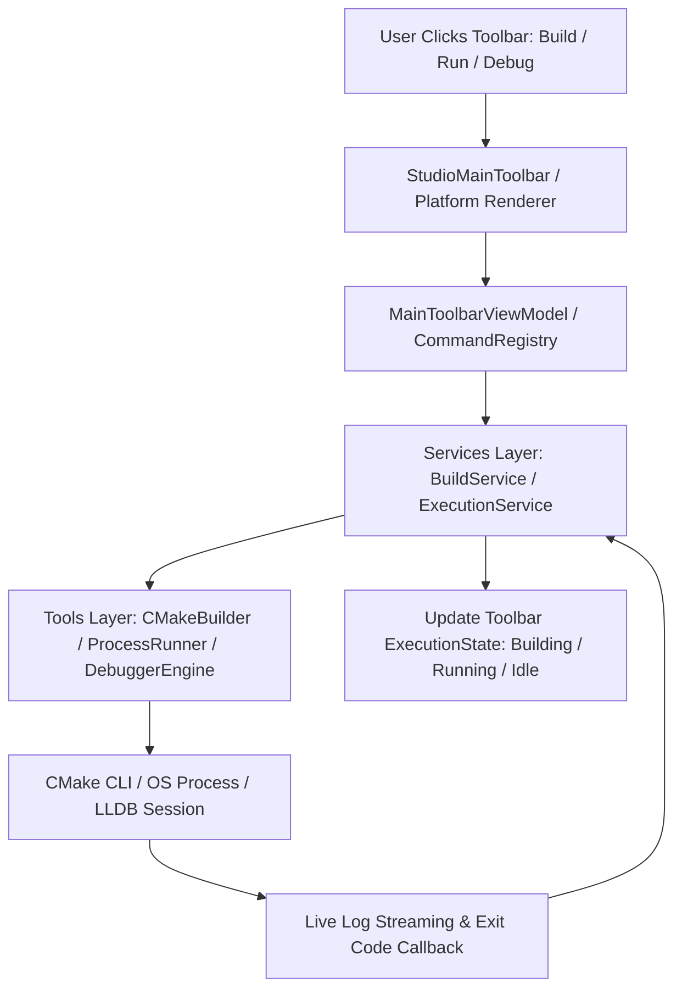

# ZDE Studio Main Toolbar Architecture & Implementation Plan

Dokumen ini menjelaskan spesifikasi lengkap, rancangan arsitektur, struktur folder, konvensi penamaan (naming convention), serta panduan implementasi untuk **Studio Main Toolbar** (bilah kontrol utama untuk Build, Run, Debug, Target Binary, Arch, dan Mode Release/Debug di workspace ZDE).

---

## 1. Prinsip & Konvensi Penamaan (Brand-Neutral Naming)

> [!IMPORTANT]
> **Aturan Penamaan Simbol Kode:**
> Seluruh variabel, fungsi, method, class, struct, enum, namespace, dan nama file **TIDAK BOLEH** menggunakan nama produk proprietary eksternal (seperti `jetbrains`, `intellij`, `clion`, `vscode`, dsb.).
> 
> Gunakan istilah domain internal ZDE yang formal, modular, dan netral:
> - **Domain/Namespace:** `Zenvra::UI::Toolbar`, `Zenvra::UI::Widgets`
> - **Class Bilah Utama:** `StudioMainToolbar`, `MainToolbarLayout`, `MainToolbarModel`
> - **Widget Kontrol Target:** `RunConfigurationWidget`, `TargetSelectorDropdown`, `ArchitectureSelector`
> - **Tipe Aksi & Preset:** `BuildConfigurationMode`, `TargetArchitecture`, `BinaryTargetProfile`, `ExecutionState`

---

## 2. Struktur Visual & Komponen Toolbar

```
+-------------------------------------------------------------------------------------------------------------------------------+
| [Left Section]           |                              [Center Section - Main Execution Controls]             | [Right Section] |
| Workspace / Branch       |  Target Selector Combo Box                 | Action Buttons                         | Search & Layout |
| [ 📁 ZDE | 🌿 main ▾ ]   |  [ ⚙️ ZDE | Debug | arm64 (macos-debug) ▾ ] | [ ▶ Run ] [ 🐞 Debug ] [ 🔨 Build ] [ ⏹ ] | [ 🔍 Search ]   |
+-------------------------------------------------------------------------------------------------------------------------------+
```

---

## 3. Detail Popover Menu: Pemilihan Binary, Mode, & Arsitektur

Saat pengguna mengklik **Target Selector Dropdown** (`RunConfigurationWidget`), muncul popover menu interaktif dengan 4 kategori:

```
+-------------------------------------------------------------+
| 🎯 Executable Binary Targets                                |
|   ● ZDE (Main Application)                                  |
|   ○ ZDEUnitTests (Test Runner)                              |
|   ○ Custom CMake Target...                                  |
+-------------------------------------------------------------+
| ⚙️ Build Configuration Mode                                 |
|   ● Debug          (-O0 -g -D_DEBUG)                        |
|   ○ Release        (-O3 -DNDEBUG)                           |
|   ○ RelWithDebInfo (-O2 -g)                                 |
|   ○ MinSizeRel     (-Os)                                    |
+-------------------------------------------------------------+
| 💻 Target Architecture (Arch)                               |
|   ● arm64     (Apple Silicon / AArch64)                     |
|   ○ x86_64    (Intel 64-bit)                                |
|   ○ Universal (Fat Binary arm64 + x86_64)                   |
+-------------------------------------------------------------+
| 📦 CMake Build Presets                                      |
|   ● macos-debug                                             |
|   ○ macos-release                                           |
+-------------------------------------------------------------+
| ⚙️ Edit Build & Run Configurations...                        |
+-------------------------------------------------------------+
```

---

## 4. Tombol Kontrol Aksi (Execution Buttons)

Toolbar utama menyediakan tombol kontrol yang terikat langsung ke command engine ZDE:

1. **Build Button (`🔨`)** -> `zde.build.target`:
   - Menjalankan `cmake --build --preset <preset> --target <binary>`.
   - Mengubah status toolbar ke `ExecutionState::Building` (animasi progress spinner).
2. **Run / Play Button (`▶`)** -> `zde.run.start`:
   - Meluncurkan binary hasil kompilasi.
   - Mengubah status toolbar ke `ExecutionState::Running` (status badge hijau).
3. **Debug Button (`🐞`)** -> `zde.debug.start`:
   - Meluncurkan binary dengan debugger (LLDB di macOS/Linux, GDB/MSVC Debugger di Windows).
   - Mengubah status toolbar ke `ExecutionState::Debugging` (status badge oranye).
4. **Stop Button (`⏹`)** -> `zde.run.stop`:
   - Menghentikan proses build yang sedang berlangsung atau mematikan proses binary yang sedang running/debugging.

---

## 5. Struktur Folder & Modul Kode

```
Source/
├── Tools/                               -> Perkakas Eksekusi (Builder, Runner, Debugger)
│   ├── CMakeLists.txt
│   ├── Builder/
│   │   ├── CMakeBuilder.h / .cpp        -> Engine kompilasi CMake (--build, presets, targets)
│   ├── Runner/
│   │   ├── ProcessRunner.h / .cpp       -> Engine peluncur proses binary lintas platform
│   └── Debugger/
│       ├── DebuggerEngine.h / .cpp      -> Engine tooling mini debugger (LLDB, GDB, DAP)
├── Services/                            -> Layer Koordinator Layanan Asynchronous
│   ├── CMakeLists.txt
│   ├── Build/
│   │   ├── BuildService.h / .cpp        -> Layanan asynchronous build & log streaming
│   └── Execution/
│       ├── ExecutionService.h / .cpp    -> Layanan lifecycle running/stop binary
├── UI/
│   └── Toolbar/
│       ├── StudioMainToolbar.h / .cpp   -> Container utama & state renderer toolbar
│       ├── ToolbarLayout.h / .cpp       -> Perhitungan posisi responsif (Left, Center, Right)
│       ├── ToolbarTypes.h               -> Enums (BuildMode, TargetArch, ExecutionState)
│       └── Widgets/
│           ├── RunConfigurationWidget.h / .cpp -> Widget combo (Binary + Mode + Arch)
│           ├── ActionButtonGroup.h / .cpp      -> Grup tombol Play, Debug, Build, Stop
│           ├── ProjectBranchWidget.h / .cpp    -> Widget project & branch Git
│           └── QuickSearchWidget.h / .cpp      -> Pill widget Search Everywhere
├── Application/
│   └── ViewModels/
│       ├── MainToolbarViewModel.h / .cpp       -> Penghubung data build & command dispatching
└── Platform/
    ├── Cocoa/Components/CocoaChromeRenderer.h / .mm -> Rendering macOS titlebar combo & clicks
    ├── Win32/Components/Win32Window.cpp             -> Rendering Windows combo & clicks
    └── X11/Components/X11Window.cpp                 -> Rendering Linux combo & clicks
```

---

## 5.1. Alur Sistematis Kerja (Workflow Architecture)


    └── X11/
        └── Components/
            ├── MainToolbarPanel.h       -> Rendering Cairo/Xlib Linux
            └── MainToolbarPanel.cpp     -> Linux input handling
```

---

## 6. Desain Header C++20

### 6.1. Tipe Data Target & Konfigurasi (`Source/UI/Toolbar/ToolbarTypes.h`)

```cpp
#pragma once

#include <cstdint>
#include <string>
#include <vector>

namespace Zenvra::UI::Toolbar
{

enum class BuildConfigurationMode : std::uint8_t
{
    Debug,
    Release,
    RelWithDebInfo,
    MinSizeRel
};

enum class TargetArchitecture : std::uint8_t
{
    HostDefault,
    Arm64,
    X86_64,
    Universal
};

enum class ExecutionState : std::uint8_t
{
    Idle,
    Building,
    Running,
    Debugging,
    Terminated
};

enum class ToolbarActionType : std::uint8_t
{
    Build,
    Run,
    Debug,
    Stop
};

struct BinaryTargetProfile
{
    std::string id;
    std::string name;
    std::string executable_path;
    bool is_default = false;
};

struct RunConfigurationState
{
    std::string active_target_name = "ZDE";
    BuildConfigurationMode active_mode = BuildConfigurationMode::Debug;
    TargetArchitecture active_architecture = TargetArchitecture::Arm64;
    std::string active_preset_name = "macos-debug";
    ExecutionState execution_state = ExecutionState::Idle;
    std::vector<BinaryTargetProfile> available_targets;
};

} // namespace Zenvra::UI::Toolbar
```

---

### 6.2. Run Configuration Widget (`Source/UI/Toolbar/Widgets/RunConfigurationWidget.h`)

```cpp
#pragma once

#include "UI/Geometry.h"
#include "UI/Toolbar/ToolbarTypes.h"
#include <string>
#include <vector>

namespace Zenvra::UI::Toolbar::Widgets
{

class RunConfigurationWidget
{
public:
    RunConfigurationWidget() = default;

    void set_state(RunConfigurationState state);
    [[nodiscard]] const RunConfigurationState& get_state() const noexcept { return m_state; }

    void set_active_target(std::string_view target_name);
    void set_active_mode(BuildConfigurationMode mode) noexcept;
    void set_active_architecture(TargetArchitecture arch) noexcept;
    void set_active_preset(std::string_view preset_name);
    void set_execution_state(ExecutionState state) noexcept;

    void toggle_popover() noexcept { m_popover_open = !m_popover_open; }
    void close_popover() noexcept { m_popover_open = false; }
    [[nodiscard]] bool is_popover_open() const noexcept { return m_popover_open; }

    [[nodiscard]] std::string get_summary_label() const;
    [[nodiscard]] UI::Rect calculate_bounds(float x, float y, float dpi_scale) const noexcept;
    [[nodiscard]] UI::Rect calculate_popover_bounds(const UI::Rect& combo_bounds, float dpi_scale) const noexcept;

private:
    RunConfigurationState m_state;
    bool m_popover_open = false;
};

} // namespace Zenvra::UI::Toolbar::Widgets
```

---

### 6.3. Action Button Group (`Source/UI/Toolbar/Widgets/ActionButtonGroup.h`)

```cpp
#pragma once

#include "UI/Geometry.h"
#include "UI/Toolbar/ToolbarTypes.h"
#include <optional>

namespace Zenvra::UI::Toolbar::Widgets
{

class ActionButtonGroup
{
public:
    ActionButtonGroup() = default;

    void set_execution_state(ExecutionState state) noexcept { m_execution_state = state; }
    [[nodiscard]] ExecutionState get_execution_state() const noexcept { return m_execution_state; }

    [[nodiscard]] UI::Rect calculate_bounds(float x, float y, float dpi_scale) const noexcept;
    [[nodiscard]] std::optional<ToolbarActionType> hit_test_action(
        float point_x, float point_y, const UI::Rect& group_bounds, float dpi_scale) const noexcept;

private:
    ExecutionState m_execution_state = ExecutionState::Idle;
    std::optional<ToolbarActionType> m_hovered_action;
};

} // namespace Zenvra::UI::Toolbar::Widgets
```

---

### 6.4. Main Toolbar Container (`Source/UI/Toolbar/StudioMainToolbar.h`)

```cpp
#pragma once

#include "UI/Toolbar/ToolbarLayout.h"
#include "UI/Toolbar/Widgets/ActionButtonGroup.h"
#include "UI/Toolbar/Widgets/ProjectBranchWidget.h"
#include "UI/Toolbar/Widgets/QuickSearchWidget.h"
#include "UI/Toolbar/Widgets/RunConfigurationWidget.h"

namespace Zenvra::UI::Toolbar
{

class StudioMainToolbar
{
public:
    StudioMainToolbar() = default;

    void update_dpi_scale(float dpi_scale) noexcept;

    [[nodiscard]] Widgets::RunConfigurationWidget& get_run_config_widget() noexcept { return m_run_config_widget; }
    [[nodiscard]] const Widgets::RunConfigurationWidget& get_run_config_widget() const noexcept { return m_run_config_widget; }

    [[nodiscard]] Widgets::ActionButtonGroup& get_action_button_group() noexcept { return m_action_button_group; }
    [[nodiscard]] const Widgets::ActionButtonGroup& get_action_button_group() const noexcept { return m_action_button_group; }

    [[nodiscard]] Widgets::ProjectBranchWidget& get_project_branch_widget() noexcept { return m_branch_widget; }
    [[nodiscard]] Widgets::QuickSearchWidget& get_quick_search_widget() noexcept { return m_search_widget; }

    [[nodiscard]] ToolbarLayoutResult layout(float container_width, float content_top) const noexcept;

private:
    float m_dpi_scale = 1.0F;
    Widgets::RunConfigurationWidget m_run_config_widget;
    Widgets::ActionButtonGroup m_action_button_group;
    Widgets::ProjectBranchWidget m_branch_widget;
    Widgets::QuickSearchWidget m_search_widget;
};

} // namespace Zenvra::UI::Toolbar
```

---

## 7. Integrasi dengan Sistem Build CMake

1. **Target Discovery**:
   - `MainToolbarViewModel` membaca `CMakePresets.json` dan query target CMake yang tersedia (`ZDE`, `ZDEUnitTests`, dsb.).
2. **Build Execution**:
   - Memanggil `zde.build.target` -> Menjalankan `cmake --build --preset <active_preset> --target <active_target>`.
3. **Run Execution**:
   - Menjalankan path binary target aktif dengan konfigurasi mode Release/Debug.
4. **Debug Execution**:
   - Menginisialisasi session LLDB/GDB dengan binary target aktif.
