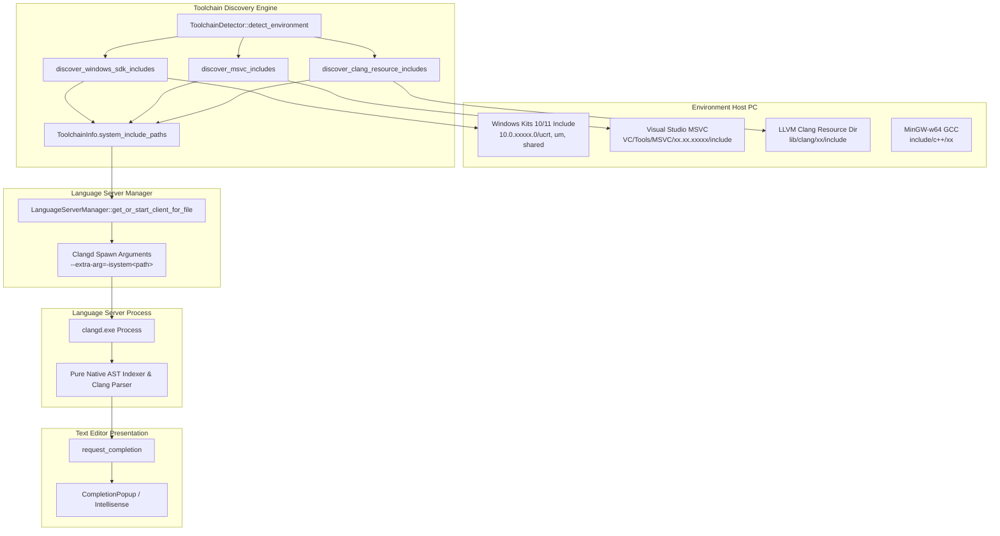

# Arsitektur Integrasi Clangd & Dynamic Windows SDK Discovery di ZDE Studio

Dokumen ini merupakan panduan standarisasi teknis mengenai arsitektur integrasi **`clangd`**, akar permasalahan deteksi header C++ di platform Windows, serta solusi **Dynamic Toolchain & SDK Discovery** agar `clangd` beroperasi 100% secara native tanpa memerlukan hardcoded list atau manual fallback pada sisi editor.

---

## 1. Latar Belakang & Pernyataan Masalah

### 1.1 Karakteristik Binary `clangd.exe`
* **Language Server Protocol (LSP) Engine**: Binary `clangd.exe` adalah mesin parser Abstract Syntax Tree (AST), semantic analyzer, dan symbol indexer berbasis Clang/LLVM.
* **Tidak Memaketkan Header Internal**: `clangd.exe` **tidak memaketkan (embed) file header C++ standard (`<iostream>`, `<vector>`, `<string>`) di dalam binary `.exe`-nya**. `clangd` mengandalkan pembacaan file header nyata yang terpasang pada compiler toolchain di sistem operasi *host*.

### 1.2 Perbedaan Perilaku Antar Platform (Windows vs Linux/macOS)

```text
┌─────────────────────────────────────────────────────────────────────────────────────────┐
│                               PERBANDINGAN DETEKSI HEADER LSP                           │
├────────────────────────────┬────────────────────────────┬───────────────────────────────┤
│ Platform                   │ Mekanisme Header Default   │ Status Deteksi Clangd Native  │
├────────────────────────────┼────────────────────────────┼───────────────────────────────┤
│ Linux                      │ Path global POSIX tetap:   │ Langsung terbaca otomatis     │
│                            │ `/usr/include/c++/...`     │ via built-in default paths    │
├────────────────────────────┼────────────────────────────┼───────────────────────────────┤
│ macOS                      │ Xcode SDK / Command Line   │ Otomatis memanggil            │
│                            │ Tools via `xcrun` SDK path │ `xcrun --show-sdk-path`       │
├────────────────────────────┼────────────────────────────┼───────────────────────────────┤
│ Windows                    │ Terfragmentasi & Dinamis:  │ Memerlukan injeksi path       │
│ (Windows 10 / 11)          │ • MSVC versi berlainan     │ sistem eksplisit              │
│                            │ • Windows Kits versi beda  │ (`--extra-arg=-isystem...`)   │
│                            │ • Scoop LLVM / MinGW       │                               │
└────────────────────────────┴────────────────────────────┴───────────────────────────────┘
```

---

## 2. Analisis Akar Masalah (*Root Cause Analysis*)

1. **Fragmentasi Versi Windows SDK & MSVC**:
   - Di Windows, setiap komputer memiliki versi SDK berbeda (misal Windows 10 SDK `10.0.19041.0`, Windows 11 SDK `10.0.22621.0` atau `10.0.26100.0`).
   - Folder instalasi Visual Studio bervariasi antara versi 2019, 2022, 2026 (v18), Community, Professional, Enterprise, hingga BuildTools.
2. **Anti-Pattern Manual Fallback di Editor**:
   - Pendekatan manual dengan membuat database hardcoded string (seperti list `<iostream>`, `std::cout`) di dalam kode C++ editor memiliki kelemahan fatal:
     - Tidak mendukung tipe data buatan pengguna (*user-defined types*).
     - Tidak memiliki informasi tipe mendalam (template signatures, parameter hints, hover docs, go-to-definition).
     - Rentan usang (*stale*) dan tidak konsisten dengan compiler sebenarnya.
3. **Solusi Standar Industri**:
   - Menggunakan modul **Dynamic Toolchain Discovery** yang mendeteksi compiler dan SDK host secara otomatis saat runtime, lalu meneruskan path `-isystem` langsung ke proses `clangd.exe`.
   - Menjaga pipeline `request_completion` di sisi editor tetap **100% murni (*pure pass-through*)** menerima data asli dari `clangd`.

---

## 3. Diagram Alur Arsitektur Dynamic Discovery



---

## 4. Rincian Implementasi Teknis

### 4.1 Pemindaian Dinamis Windows SDK ([ToolchainDetector.cpp](file:///c:/Users/Administrator/Downloads/ZDE-minimal/Source/Language/Toolchain/ToolchainDetector.cpp))
Fungsi `discover_windows_sdk_includes()` memindai direktori Windows Kits:
```text
C:\Program Files (x86)\Windows Kits\10\Include
C:\Program Files\Windows Kits\10\Include
```
1. Membaca seluruh subfolder versi SDK yang terpasang (`10.0.xxxxx.0`).
2. Mengurutkan nama folder secara **descending** sehingga versi SDK tertinggi/terbaru yang valid otomatis terpilih.
3. Mengumpulkan subdirektori penting:
   - `ucrt` (Universal C Runtime: `stdio.h`, `stdlib.h`, `math.h`, dll.)
   - `um` (Windows User Mode API: `windows.h`, `winuser.h`, `d3d11.h`, dll.)
   - `shared` (Definisi tipe dasar Windows: `windef.h`, `winerror.h`, dll.)
   - `winrt` & `cppwinrt` (Windows Runtime C++ bindings)

### 4.2 Pemindaian Dinamis MSVC C++ STL
Fungsi `discover_msvc_includes()` memindai seluruh edisi Visual Studio:
```text
C:\Program Files\Microsoft Visual Studio\<Year>\<Edition>\VC\Tools\MSVC\<Version>\
C:\Program Files (x86)\Microsoft Visual Studio\<Year>\<Edition>\VC\Tools\MSVC\<Version>\
```
1. Mendukung Visual Studio 2019, 2022, 2026 (v18), Community, Professional, Enterprise, BuildTools, dan Preview.
2. Memilih versi MSVC tertinggi yang memiliki file `include/iostream`.
3. Mengumpulkan path `include/` dan `atlmfc/include/`.

### 4.3 Injeksi Argumen ke `clangd` ([LanguageServerManager.cpp](file:///c:/Users/Administrator/Downloads/ZDE-minimal/Source/Language/LanguageServerManager.cpp))
Saat `LanguageServerManager` men-spawn client untuk C/C++, seluruh `system_include_paths` disuntikkan secara dinamis:
```cpp
const auto &toolchain = Toolchain::ToolchainDetector::instance().get_active_toolchain();
for (const auto &inc_path : toolchain.system_include_paths) {
  if (!inc_path.empty()) {
    args.push_back("--extra-arg=-isystem" + inc_path.generic_string());
  }
}
```

### 4.4 Pure Pass-Through Completion
Fungsi `request_completion` tidak lagi memodifikasi atau menggabungkan hardcoded list fallback:
```cpp
auto *client = get_or_start_client_for_file(filename);
if (client != nullptr && (client->is_active() || client->get_state() == Client::ClientState::Initializing)) {
  client->request_completion(
      uri, pos,
      [callback = std::move(callback)](std::vector<Protocol::CompletionItem> lsp_items) {
        if (callback) {
          callback(std::move(lsp_items));
        }
      });
} else if (callback) {
  callback({});
}
```

---

## 5. Matriks Troubleshooting & Validasi

| Gejala / Kondisi | Kemungkinan Penyebab | Tindakan Sistem / Solusi |
|---|---|---|
| Popup completion kosong saat mengetik `#include <` atau `std::` | `clangd` belum menerima path include SDK sistem host. | Pastikan `ToolchainDetector` mendeteksi SDK (`has_standard_headers == true`) dan flag `--extra-arg=-isystem` terkirim ke `clangd`. |
| Pengguna memakai Windows 10 SDK lama (misal `10.0.19041.0`) | Versi SDK lebih rendah dari Windows 11. | Algoritma dynamic discovery otomatis memilih versi SDK tertinggi yang ada di folder `Windows Kits\10\Include` tanpa error. |
| Pengguna hanya menginstall Scoop LLVM tanpa Visual Studio | Header STL MSVC tidak ada. | `ToolchainDetector` mendeteksi Clang Resource headers dan MinGW GCC / Scoop GCC headers jika tersedia. |
| File C++ di luar direktori project CMake | Tidak tercatat di `compile_commands.json`. | Flag `--extra-arg=-isystem...` memastikan file standalone tetap mendapatkan include path standard C++ secara lengkap. |

---

## 6. Referensi Berkas Terkait
* [`Source/Language/Toolchain/ToolchainDetector.h`](file:///c:/Users/Administrator/Downloads/ZDE-minimal/Source/Language/Toolchain/ToolchainDetector.h) - Definisi struktur `ToolchainInfo` dan interface detektor.
* [`Source/Language/Toolchain/ToolchainDetector.cpp`](file:///c:/Users/Administrator/Downloads/ZDE-minimal/Source/Language/Toolchain/ToolchainDetector.cpp) - Implementasi pemindaian dinamis SDK Windows, MSVC, Clang, dan MinGW.
* [`Source/Language/LanguageServerManager.cpp`](file:///c:/Users/Administrator/Downloads/ZDE-minimal/Source/Language/LanguageServerManager.cpp) - Injeksi argumen startup `clangd` dan pure pass-through completion request.
* [`Source/Language/Registry/ServerRegistry.cpp`](file:///c:/Users/Administrator/Downloads/ZDE-minimal/Source/Language/Registry/ServerRegistry.cpp) - Profile konfigurasi default server LSP `clangd`.
