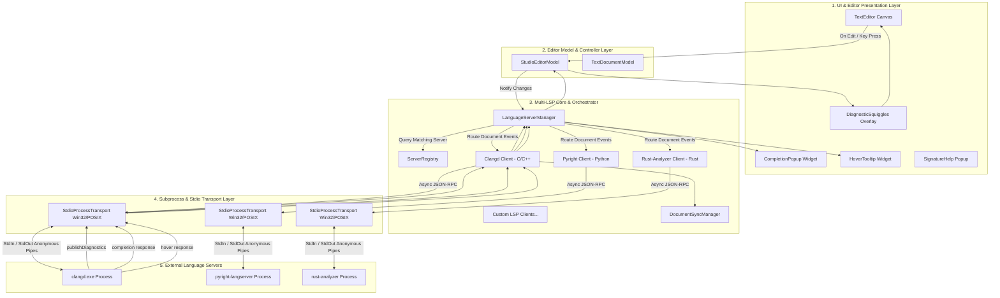
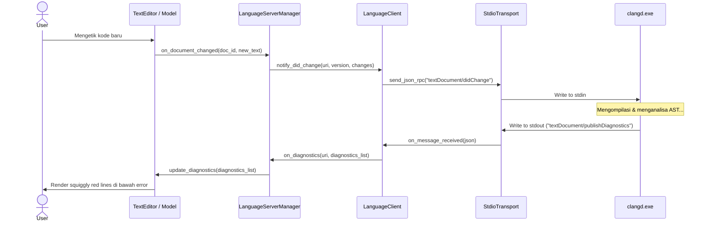
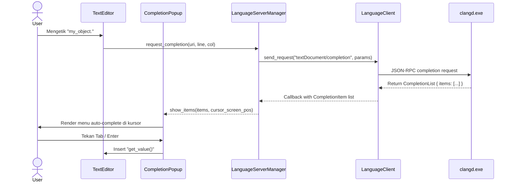

# Dokumen Perencanaan Arsitektur Multi-LSP (Language Server Protocol) untuk ZDE Studio

Dokumen ini memetakan arsitektur lengkap, diagram interaksi, struktur folder terorganisir, dependensi, dan tahapan implementasi untuk mengintegrasikan **Multi-LSP Client** (Clangd, Pyright, Rust-Analyzer, gopls, vtsls/tsserver, dll.) ke dalam ZDE Studio.

---

## 1. Diagram Arsitektur Multi-LSP

LSP (Language Server Protocol) berbasis **JSON-RPC 2.0** melalui stream **Standard Input/Output (`stdio`)**. Agar ZDE Studio dapat menangani banyak bahasa sekaligus secara modular, arsitektur dibagi menjadi 4 layer:



---

## 2. Struktur Folder & File yang Akan Diimplementasikan

Berikut struktur modular yang akan dibangun di dalam folder `Source/Language/` dan `Source/UI/Components/`:

```text
Source/
├── Language/
│   ├── CMakeLists.txt                         # Build rules untuk library ZDELanguage
│   ├── LanguageConfiguration.h                # Pengaturan tab, comment, auto-close per bahasa
│   ├── LanguageServerManager.h                # Core Multi-LSP orchestrator & multiplexer
│   ├── LanguageServerManager.cpp
│   │
│   ├── Protocol/                              # LSP JSON-RPC Protocol & Data Types
│   │   ├── LspTypes.h                         # Struct Position, Range, Location, Diagnostic, CompletionItem, Hover
│   │   ├── LspMessage.h                       # Request, Response, Notification, JsonRpcPacket
│   │   ├── LspProtocolSerializer.h            # Serialization & Deserialization JSON-RPC 2.0
│   │   └── LspProtocolSerializer.cpp
│   │
│   ├── Transport/                             # Subprocess & Async Stdio Pipe Engine
│   │   ├── ILspTransport.h                    # Interface abstrak untuk transport stream
│   │   ├── StdioProcessTransport.h            # Win32 (CreateProcess+Pipes) & POSIX (fork+pipes)
│   │   └── StdioProcessTransport.cpp
│   │
│   ├── Client/                                # Language Client Session Instance
│   │   ├── ILanguageClient.h                  # Interface operasi LSP
│   │   ├── LanguageClient.h                   # Stateful LSP Client (Lifecycle, Request Queue, Promises)
│   │   ├── LanguageClient.cpp
│   │   ├── DocumentSyncManager.h              # didOpen, didChange incremental/full, didSave, didClose
│   │   └── DocumentSyncManager.cpp
│   │
│   └── Registry/                              # Server Profiles & Auto-Discovery
│       ├── ServerProfile.h                    # Definisi profil server (executable, args, extensions, root markers)
│       ├── ServerRegistry.h                   # Registry pemetaan extension -> server (Clangd, Pyright, dll.)
│       └── ServerRegistry.cpp
│
└── UI/
    └── Components/
        ├── CompletionPopup.h                  # Floating autocomplete popup widget (icons, fuzzy search, doc preview)
        ├── CompletionPopup.cpp
        ├── HoverTooltip.h                     # Floating markdown documentation tooltip widget
        ├── HoverTooltip.cpp
        ├── SignatureHelpWidget.h              # Floating parameter hints widget
        └── SignatureHelpWidget.cpp
```

---

## 3. Rincian Tanggung Jawab Tiap File

### 📂 `Source/Language/Protocol/` (Protokol & Data Types)
1. **`LspTypes.h`**:
   - `Position`: Baris dan kolom kursor (`line`, `character`).
   - `Range`: Rentang teks dari `start Position` ke `end Position`.
   - `Location`: URI file + `Range` (digunakan untuk *Go to Definition* dan *Find References*).
   - `Diagnostic`: Error/Warning dari compiler (`Range`, `DiagnosticSeverity`, `message`, `source`, `code`).
   - `CompletionItem`: Item auto-complete (`label`, `CompletionItemKind`, `detail`, `documentation`, `insertText`).
   - `Hover`: Isi dokumentasi dan markdown tooltip.

2. **`LspProtocolSerializer.h / .cpp`**:
   - Fungsi untuk memformat pesan JSON-RPC:
     `Content-Length: <panjang_byte>\r\n\r\n{"jsonrpc":"2.0","id":1,"method":"textDocument/completion",...}`
   - Parser response masuk untuk mengubah string JSON menjadi struct `LspTypes`.

---

### 📂 `Source/Language/Transport/` (Subprocess & Stdio Streams)
1. **`ILspTransport.h`**:
   - Interface abstrak dengan fungsi `start()`, `stop()`, `send_message(const std::string& msg)`, dan callback event `on_message_received(std::string)`.
2. **`StdioProcessTransport.h / .cpp`**:
   - **Win32**: Menggunakan `CreateProcessW` dengan `STARTF_USESTDHANDLES`, anonymous pipes untuk `stdin`/`stdout`, serta `std::thread` background worker untuk membaca stream `stdout` secara non-blocking.
   - **POSIX (Linux/macOS)**: Menggunakan `fork()`, `execvp()`, dan `pipe()` / `poll()`.
   - Menjamin proses server mati secara bersih saat ZDE Studio ditutup.

---

### 📂 `Source/Language/Client/` (LSP Session & Document Synchronization)
1. **`LanguageClient.h / .cpp`**:
   - **State Machine Lifecycle**:
     `Uninitialized` $\to$ `Initializing` (mengirim `initialize` request) $\to$ `Initialized` (notifikasi `initialized`) $\to$ `Active` $\to$ `Shutdown` $\to$ `Exit`.
   - Mengelola ID request yang sedang berjalan dan mencocokkan response asinkron ke callback pemanggil.
2. **`DocumentSyncManager.h / .cpp`**:
   - **`didOpen`**: Mengirim isi lengkap file saat dibuka di editor.
   - **`didChange`**: Mengirim versi dokumen terbaru saat user mengetik.
   - **`didSave`**: Notifikasi bahwa file telah disimpan (`Ctrl+S`).
   - **`didClose`**: Notifikasi bahwa tab file telah ditutup.

---

### 📂 `Source/Language/Registry/` (Multi-LSP Server Configuration)
1. **`ServerProfile.h`**:
   - Struktur konfigurasi server:
     ```cpp
     struct ServerProfile {
         std::string language_id;             // "cpp", "python", "rust", "go"
         std::vector<std::string> extensions; // {".cpp", ".h", ".hpp", ".c"}
         std::string executable_name;        // "clangd" atau "clangd.exe"
         std::vector<std::string> default_args;// {"--background-index", "--clang-tidy"}
         std::vector<std::string> root_markers;// {"CMakeLists.txt", "compile_commands.json"}
     };
     ```
2. **`ServerRegistry.h / .cpp`**:
   - Pendaftaran default profile untuk bahasa populer (C/C++, Python, Rust, Go, TypeScript).
   - Mendeteksi keberadaan binary di `PATH` sistem operasi atau lokasi custom.

---

### 📂 `Source/Language/LanguageServerManager.h / .cpp` (Orchestrator Utama)
* Bertindak sebagai *Facade* dan *Router*:
  * Menerima event dari `StudioEditorModel` (misal: "User mengetik di file `main.cpp`").
  * Memeriksa apakah `clangd` sudah aktif. Jika belum, melakukan *Lazy Start* (menjalankan `clangd` hanya saat diperlukan).
  * Mem-forward event dokumen ke client yang sesuai.
  * Menerima notifikasi `publishDiagnostics` dari server dan menyebarkannya ke TextEditor.

---

### 📂 `Source/UI/Components/` (Komponen UI Editor)
1. **`CompletionPopup.h / .cpp`**:
   - Floating window di bawah kursor teks yang menampilkan daftar auto-complete.
   - Dilengkapi icon (Method, Variable, Class, Keyword) dan preview dokumentasi di samping kanan.
   - Navigasi tombol `Up`/`Down`, `Tab`/`Enter` untuk memilih item.
2. **`HoverTooltip.h / .cpp`**:
   - Tooltip semi-transparan dengan gaya VS Code/frosted glass yang menampilkan tipe data dan dokumentasi saat mouse berhenti di atas identifier.
3. **`DiagnosticSquiggles`** (diintegrasikan pada `TextEditor.cpp`):
   - Garis bergelombang merah (Error) dan kuning (Warning) yang dirender di bawah kata yang salah.

---

## 4. Sequence Diagram Interaksi LSP

### A. Alur Saat User Mengetik Kode (`didChange` & `publishDiagnostics`)


### B. Alur Auto-Completion (`Ctrl+Space` atau Mengetik `.`)


---

## 5. Rencana Tahapan Eksekusi (Checklist Roadmap)

### 📌 **Tahap 1: Fondasi Transport & Serializer JSON-RPC**
- [ ] Buat `Source/Language/Protocol/LspTypes.h` dan `LspMessage.h`.
- [ ] Buat `Source/Language/Transport/StdioProcessTransport.h/.cpp` untuk Windows & POSIX.
- [ ] Buat unit test di `Tests/LanguageServerTests.cpp` untuk verifikasi handshake `initialize` dengan `clangd`.

### 📌 **Tahap 2: Document Sync & Diagnostics Display**
- [ ] Buat `Source/Language/Client/DocumentSyncManager.h/.cpp` (`didOpen`, `didChange`, `didSave`, `didClose`).
- [ ] Integrasikan callback `textDocument/publishDiagnostics` ke `TextDocumentModel`.
- [ ] Implementasikan visual garis bergelombang (*squiggly lines*) di `TextEditor.cpp`.

### 📌 **Tahap 3: IntelliSense Completion Popup**
- [ ] Buat UI widget `Source/UI/Components/CompletionPopup.h/.cpp`.
- [ ] Pasang event key interceptor di `TextEditor.cpp` untuk navigasi popup (`Up`, `Down`, `Enter`, `Tab`, `Escape`).
- [ ] Hubungkan request `textDocument/completion` saat user mengetik karakter trigger (`.`, `->`, `::`).

### 📌 **Tahap 4: Hover Tooltip & Go to Definition (`F12`)**
- [ ] Buat `Source/UI/Components/HoverTooltip.h/.cpp`.
- [ ] Pasang timer mouse hover (500ms) untuk trigger request `textDocument/hover`.
- [ ] Implementasikan shortcut `F12` untuk request `textDocument/definition` yang langsung melompat ke file target.

### 📌 **Tahap 5: Multi-LSP Registry & Multi-Language Support**
- [ ] Buat `Source/Language/Registry/ServerRegistry.h/.cpp`.
- [ ] Konfigurasikan preset untuk:
  - **C/C++**: `clangd`
  - **Python**: `pyright` / `jedi-language-server`
  - **Rust**: `rust-analyzer`
  - **JS/TS**: `typescript-language-server`
  - **Go**: `gopls`
