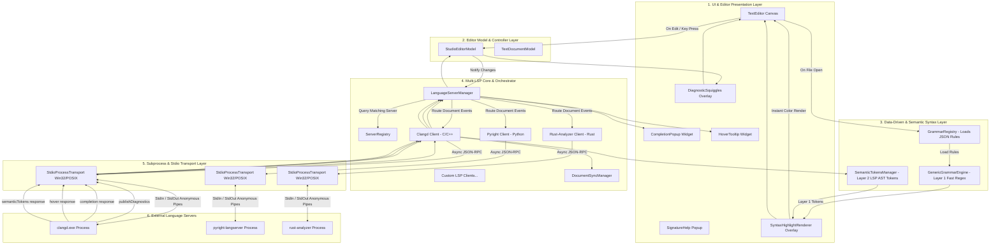
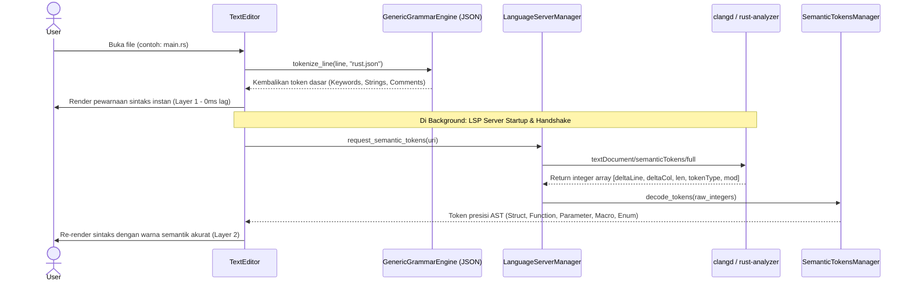
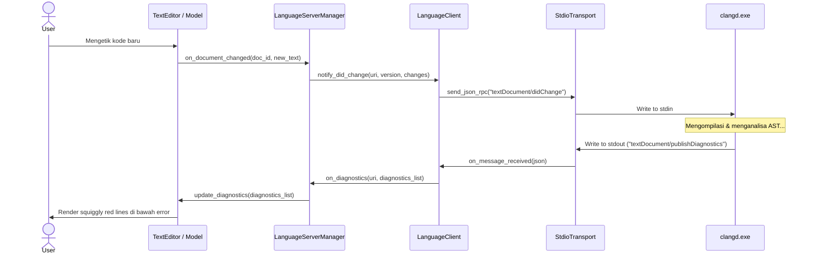
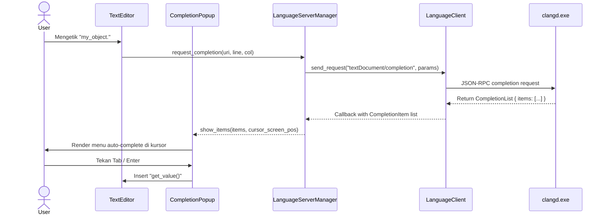

# Dokumen Perencanaan Arsitektur Multi-LSP & Data-Driven Syntax Highlighting untuk ZDE Studio

Dokumen ini memetakan arsitektur lengkap, diagram interaksi, struktur folder terorganisir, dependensi, dan tahapan implementasi untuk mengintegrasikan **Multi-LSP Client** (Clangd, Pyright, Rust-Analyzer, gopls, vtsls/tsserver, dll.) serta sistem **Syntax Highlighting Otomatis & Terpadu** (Dual-Layer: Data-Driven Grammar JSON + LSP Semantic Tokens) ke dalam ZDE Studio **tanpa perlu menulis parser/lexer C++ manual untuk setiap bahasa**.

---

## 1. Masalah & Solusi Syntax Highlighting (Tanpa Manual C++)

### ❌ Masalah Saat Ini
* Pewarnaan sintaks di-hardcode secara statis di C++ (`UI::Editor::tokenize_editor_line` di [StudioEditorModel.cpp](file:///c:/Users/Administrator/Documents/ZDE/ZDE-minimal/Source/UI/Editor/StudioEditorModel.cpp)).
* Menambahkan dukungan bahasa baru (Python, Rust, Go, JavaScript, TypeScript, HTML, CSS, JSON, dll.) sangat melelahkan karena harus menulis parser karakter demi karakter di C++ dan mengompilasi ulang seluruh aplikasi.
* Lexer manual sederhana tidak memiliki pemahaman tipe (*type-awareness*), context scope, macro, atau identifier detail.

###  Solusi Arsitektur Dual-Layer Syntax Highlighting
ZDE Studio mengadopsi pendekatan dua lapis yang fleksibel dan otomatis:

```text
┌────────────────────────────────────────────────────────────────────────┐
│                      DUAL-LAYER SYNTAX ENGINE                          │
├──────────────────────────────────┬─────────────────────────────────────┤
│   Layer 1: Fast Data-Driven      │   Layer 2: LSP Semantic Tokens      │
│   (Grammar JSON / TextMate)      │   (Compiler-Accurate AST Highlight) │
├──────────────────────────────────┼─────────────────────────────────────┤
│ • Aktif instan saat file dibuka  │ • Dihasilkan langsung dari Language │
│ • Berbasis file konfigurasi JSON │   Server (Clangd, Pyright, dll.)   │
│   di folder `Assets/Grammars/`   │ • Mendeteksi Tipe, Fungsi, Method,  │
│ • Regex pattern untuk keyword,   │   Parameter, Variable, Enum, Const  │
│   string, comment, number        │ • Update asinkron di background     │
│ • Menghilangkan C++ hardcoded    │ • Sangat presisi sekelas VS Code /  │
│   lexer untuk bahasa baru        │   CLion tanpa menulis kode parser   │
└──────────────────────────────────┴─────────────────────────────────────┘
```

---

## 2. Diagram Arsitektur Multi-LSP & Syntax Engine

LSP (Language Server Protocol) berbasis **JSON-RPC 2.0** melalui stream **Standard Input/Output (`stdio`)**.



---

## 3. Struktur Folder & File yang Akan Diimplementasikan

Berikut struktur modular yang akan dibangun di dalam folder `Source/Language/`, `Assets/Grammars/`, dan `Source/UI/Components/`:

```text
Source/
├── Language/
│   ├── CMakeLists.txt                         # Build rules untuk library ZDELanguage
│   ├── LanguageConfiguration.h                # Pengaturan tab, comment, auto-close per bahasa
│   ├── LanguageServerManager.h                # Core Multi-LSP orchestrator & multiplexer
│   ├── LanguageServerManager.cpp
│   │
│   ├── Protocol/                              # LSP JSON-RPC Protocol & Data Types
│   │   ├── LspTypes.h                         # Struct Position, Range, Location, Diagnostic, CompletionItem, Hover
│   │   ├── LspMessage.h                       # Request, Response, Notification, JsonRpcPacket
│   │   ├── LspProtocolSerializer.h            # Serialization & Deserialization JSON-RPC 2.0
│   │   └── LspProtocolSerializer.cpp
│   │
│   ├── Syntax/                                # Data-Driven & Semantic Syntax Highlighting Engine
│   │   ├── SemanticTokenTypes.h               # Token types (Type, Function, Parameter, Variable, Enum, dll.) & Modifiers
│   │   ├── SemanticTokensManager.h            # LSP textDocument/semanticTokens request & 5-tuple delta decoder
│   │   ├── SemanticTokensManager.cpp
│   │   ├── GrammarRule.h                      # Struct aturan regex pattern grammar (keyword, string, comment, number, operator)
│   │   ├── GrammarRegistry.h                  # Registry JSON syntax grammar per ekstensi file
│   │   ├── GrammarRegistry.cpp
│   │   ├── GenericGrammarEngine.h             # Tokenizer generik berbasis data JSON (menggantikan C++ manual lexer)
│   │   └── GenericGrammarEngine.cpp
│   │
│   ├── Transport/                             # Subprocess & Async Stdio Pipe Engine
│   │   ├── ILspTransport.h                    # Interface abstrak untuk transport stream
│   │   ├── StdioProcessTransport.h            # Win32 (CreateProcess+Pipes) & POSIX (fork+pipes)
│   │   └── StdioProcessTransport.cpp
│   │
│   ├── Client/                                # Language Client Session Instance
│   │   ├── ILanguageClient.h                  # Interface operasi LSP
│   │   ├── LanguageClient.h                   # Stateful LSP Client (Lifecycle, Request Queue, Promises)
│   │   ├── LanguageClient.cpp
│   │   ├── DocumentSyncManager.h              # didOpen, didChange incremental/full, didSave, didClose
│   │   └── DocumentSyncManager.cpp
│   │
│   └── Registry/                              # Server Profiles & Auto-Discovery
│       ├── ServerProfile.h                    # Definisi profil server (executable, args, extensions, root markers)
│       ├── ServerRegistry.h                   # Registry pemetaan extension -> server (Clangd, Pyright, dll.)
│       └── ServerRegistry.cpp
│
├── UI/
│   └── Components/
│       ├── CompletionPopup.h                  # Floating autocomplete popup widget (icons, fuzzy search, doc preview)
│       ├── CompletionPopup.cpp
│       ├── HoverTooltip.h                     # Floating markdown documentation tooltip widget
│       ├── HoverTooltip.cpp
│       ├── SignatureHelpWidget.h              # Floating parameter hints widget
│       └── SignatureHelpWidget.cpp
│
Assets/
└── Grammars/                                  # Definisi Sintaks Berbasis JSON (Zero C++ Coding untuk Bahasa Baru!)
    ├── c_cpp.json                             # Syntax rules untuk .c, .cpp, .h, .hpp, .cc
    ├── python.json                            # Syntax rules untuk .py, .pyw
    ├── rust.json                              # Syntax rules untuk .rs
    ├── go.json                                # Syntax rules untuk .go
    ├── javascript.json                        # Syntax rules untuk .js, .jsx, .ts, .tsx
    ├── json.json                              # Syntax rules untuk .json
    ├── yaml.json                              # Syntax rules untuk .yaml, .yml
    ├── markdown.json                          # Syntax rules untuk .md
    ├── html_css.json                          # Syntax rules untuk .html, .css
    └── shell.json                             # Syntax rules untuk .sh, .bash, .ps1, .bat
```

---

## 4. Rincian Tanggung Jawab Tiap File & Modul

### 📂 `Source/Language/Syntax/` (Data-Driven & Semantic Highlighting)
1. **`SemanticTokensManager.h / .cpp` (Layer 2 - LSP Precision)**:
   - Mengirim request `textDocument/semanticTokens/full` atau `textDocument/semanticTokens/range` ke LSP server aktif saat user selesai mengetik (dengan debounce ~100ms).
   - **Decoding LSP 5-Tuple Delta Integer**:
     LSP mengirim token dalam format flat array integer berkelipatan 5:
     `[deltaLine, deltaStartChar, length, tokenType, tokenModifiers]`
   - `SemanticTokensManager` melakukan rekursi dekode dari posisi relatif ke posisi absolut baris/kolom teks, lalu memetakan index `tokenType` ke warna palet editor (`Theme::Color`).
2. **`SemanticTokenTypes.h`**:
   - Tipe token standar LSP: `Type`, `Class`, `Enum`, `Interface`, `Struct`, `TypeParameter`, `Parameter`, `Variable`, `Property`, `EnumMember`, `Function`, `Method`, `Macro`, `Keyword`, `Modifier`, `Comment`, `String`, `Number`, `Regexp`, `Operator`.
   - Modifiers: `Declaration`, `Definition`, `Readonly`, `Static`, `Deprecated`, `Abstract`, `Async`, `Documentation`.
3. **`GenericGrammarEngine.h / .cpp` (Layer 1 - Data-Driven JSON Highlighting)**:
   - Tokenizer generik yang bekerja membaca kumpulan regex & keywords dari `GrammarRule`.
   - Menghasilkan token sintaks instan tanpa perlu menunggu Language Server aktif atau siap.
   - **Menghapus ketergantungan pada C++ manual lexer**: Menambah bahasa baru cukup dengan menambahkan satu file `.json` di folder `Assets/Grammars/`!
4. **`GrammarRegistry.h / .cpp`**:
   - Memetakan ekstensi file (misal `.rs` $\to$ `rust.json`, `.py` $\to$ `python.json`, `.go` $\to$ `go.json`).
   - Membaca file JSON saat startup dan meng-cache aturan grammar dalam memori.

---

### 📂 Contoh Format File Grammar JSON (`Assets/Grammars/rust.json`)
Cukup buat file JSON sederhana seperti ini untuk mendukung bahasa baru tanpa menulis kode C++:
```json
{
  "name": "Rust",
  "extensions": [".rs"],
  "line_comment": "//",
  "block_comment_start": "/*",
  "block_comment_end": "*/",
  "keywords": [
    "as", "async", "await", "break", "const", "continue", "crate", "dyn",
    "else", "enum", "extern", "false", "fn", "for", "if", "impl", "in",
    "let", "loop", "match", "mod", "move", "mut", "pub", "ref", "return",
    "self", "Self", "static", "struct", "super", "trait", "true", "type",
    "unsafe", "use", "where", "while"
  ],
  "types": [
    "i8", "i16", "i32", "i64", "i128", "isize",
    "u8", "u16", "u32", "u64", "u128", "usize",
    "f32", "f64", "bool", "char", "str", "String", "Option", "Result", "Vec"
  ],
  "operators": ["+", "-", "*", "/", "%", "=", "==", "!=", "<", ">", "<=", ">=", "&&", "||", "!", "&", "|", "^", "->", "=>"],
  "string_delimiters": ["\"", "'"]
}
```

---

### 📂 `Source/Language/Protocol/` (Protokol & Data Types)
1. **`LspTypes.h`**:
   - `Position`: Baris dan kolom kursor (`line`, `character`).
   - `Range`: Rentang teks dari `start Position` ke `end Position`.
   - `Location`: URI file + `Range` (digunakan untuk *Go to Definition* dan *Find References*).
   - `Diagnostic`: Error/Warning dari compiler (`Range`, `DiagnosticSeverity`, `message`, `source`, `code`).
   - `CompletionItem`: Item auto-complete (`label`, `CompletionItemKind`, `detail`, `documentation`, `insertText`).
   - `Hover`: Isi dokumentasi dan markdown tooltip.
   - `SemanticTokens`: Data token highlight `std::vector<uint32_t> data`.
2. **`LspProtocolSerializer.h / .cpp`**:
   - Serializer pesan JSON-RPC:
     `Content-Length: <panjang_byte>\r\n\r\n{"jsonrpc":"2.0","id":1,"method":"textDocument/completion",...}`
   - Deserializer response masuk untuk mengubah string JSON menjadi struct `LspTypes`.

---

### 📂 `Source/Language/Transport/` (Subprocess & Stdio Streams)
1. **`ILspTransport.h`**:
   - Interface abstrak dengan fungsi `start()`, `stop()`, `send_message(const std::string& msg)`, dan callback event `on_message_received(std::string)`.
2. **`StdioProcessTransport.h / .cpp`**:
   - **Win32**: Menggunakan `CreateProcessW` dengan `STARTF_USESTDHANDLES`, anonymous pipes untuk `stdin`/`stdout`, serta `std::thread` background worker untuk membaca stream `stdout` secara non-blocking.
   - **POSIX (Linux/macOS)**: Menggunakan `fork()`, `execvp()`, dan `pipe()` / `poll()`.
   - Menjamin proses server mati secara bersih saat ZDE Studio ditutup.

---

### 📂 `Source/Language/Client/` (LSP Session & Document Synchronization)
1. **`LanguageClient.h / .cpp`**:
   - **State Machine Lifecycle**:
     `Uninitialized` $\to$ `Initializing` $\to$ `Initialized` $\to$ `Active` $\to$ `Shutdown` $\to$ `Exit`.
   - Menangani request ID mapping, timeout handling, dan callback promise.
2. **`DocumentSyncManager.h / .cpp`**:
   - **`didOpen`**: Mengirim isi lengkap file saat dibuka di editor.
   - **`didChange`**: Mengirim versi dokumen terbaru saat user mengetik.
   - **`didSave`**: Notifikasi bahwa file telah disimpan (`Ctrl+S`).
   - **`didClose`**: Notifikasi bahwa tab file telah ditutup.

---

### 📂 `Source/Language/Registry/` (Multi-LSP Server Configuration)
1. **`ServerProfile.h`**:
   - Konfigurasi server bahasa:
     ```cpp
     struct ServerProfile {
         std::string language_id;             // "cpp", "python", "rust", "go"
         std::vector<std::string> extensions; // {".cpp", ".h", ".hpp", ".c"}
         std::string executable_name;        // "clangd" atau "clangd.exe"
         std::vector<std::string> default_args;// {"--background-index", "--clang-tidy"}
         std::vector<std::string> root_markers;// {"CMakeLists.txt", "compile_commands.json"}
     };
     ```
2. **`ServerRegistry.h / .cpp`**:
   - Pendaftaran default profile untuk C/C++, Python, Rust, Go, TypeScript/JS, dll.
   - Auto-detection binary di `PATH` sistem operasi atau lokasi toolchain lokal.

---

### 📂 `Source/Language/LanguageServerManager.h / .cpp` (Orchestrator Utama)
* Bertindak sebagai *Facade* dan *Router*:
  * Menerima event dari `StudioEditorModel` (misal: "User membuka `main.rs`").
  * Menjalankan server yang sesuai secara *Lazy Start* (misal `rust-analyzer`).
  * Mengatur sinkronisasi dokumen, diagnostics, completion, hover, dan semantic tokens.

---

### 📂 `Source/UI/Components/` (Komponen UI Editor)
1. **`CompletionPopup.h / .cpp`**: Floating window auto-complete dengan icon kind dan dokumentasi preview.
2. **`HoverTooltip.h / .cpp`**: Floating markdown tooltip saat mouse hover di atas identifier.
3. **`SignatureHelpWidget.h / .cpp`**: Parameter hint popup saat mengetik argumen fungsi `foo( | )`.
4. **`DiagnosticSquiggles` & `SemanticHighlighter`** (diintegrasikan pada `TextEditor.cpp`):
   - Merender squiggly lines error/warning.
   - Merender warna token hasil layer 1 (Grammar JSON) dan layer 2 (Semantic Tokens).

---

## 5. Sequence Diagram Interaksi LSP & Syntax Highlighting

### A. Alur Syntax Highlighting Otomatis (Dual-Layer)


### B. Alur Saat User Mengetik Kode (`didChange` & `publishDiagnostics`)


### C. Alur Auto-Completion (`Ctrl+Space` atau Mengetik `.`)


---

## 6. Rencana Tahapan Eksekusi (Checklist Roadmap)

### 📌 **Tahap 1: Data-Driven Syntax Highlighting (Bebas Hardcode C++)**
- [ ] Buat parser konfigurasi `Assets/Grammars/*.json` di `Source/Language/Syntax/GrammarRegistry.h/.cpp`.
- [ ] Buat engine `Source/Language/Syntax/GenericGrammarEngine.h/.cpp` untuk tokenisasi otomatis berbasis regex / word-lookup.
- [ ] Buat file grammar default di `Assets/Grammars/` (`c_cpp.json`, `python.json`, `rust.json`, `go.json`, `javascript.json`, `json.json`, `yaml.json`, `html_css.json`, `markdown.json`, `shell.json`).
- [ ] Refactor `tokenize_editor_line` di `StudioEditorModel.cpp` & `TextEditor.cpp` agar menggunakan `GenericGrammarEngine` (menghapus hardcoded C++ token rules).

### 📌 **Tahap 2: Fondasi Transport & Serializer JSON-RPC**
- [ ] Buat `Source/Language/Protocol/LspTypes.h` dan `LspMessage.h`.
- [ ] Buat `Source/Language/Transport/StdioProcessTransport.h/.cpp` untuk Windows (Pipes + `CreateProcessW`) & POSIX.
- [ ] Buat unit test di `Tests/LanguageServerTests.cpp` untuk verifikasi handshake `initialize` dengan `clangd`.

### 📌 **Tahap 3: Document Sync & Diagnostics Display**
- [ ] Buat `Source/Language/Client/DocumentSyncManager.h/.cpp` (`didOpen`, `didChange`, `didSave`, `didClose`).
- [ ] Integrasikan callback `textDocument/publishDiagnostics` ke `TextDocumentModel`.
- [ ] Implementasikan visual garis bergelombang (*squiggly lines*) di `TextEditor.cpp`.

### 📌 **Tahap 4: LSP Semantic Tokens (Layer 2 Syntax Highlighting)**
- [ ] Buat `Source/Language/Syntax/SemanticTokensManager.h/.cpp` & `SemanticTokenTypes.h`.
- [ ] Implementasikan decoding algoritma 5-tuple delta integer LSP (`deltaLine`, `deltaStartChar`, `length`, `tokenType`, `tokenModifiers`).
- [ ] Integrasikan hasil Semantic Tokens ke rendering layer di `TextEditor.cpp` (meng-override warna grammar dasar dengan warna AST compiler).

### 📌 **Tahap 5: IntelliSense Completion Popup & Hover Tooltip**
- [ ] Buat UI widget `Source/UI/Components/CompletionPopup.h/.cpp` dengan icons, fuzzy filter, dan doc preview.
- [ ] Hubungkan trigger completion (`.`, `->`, `::`, `Ctrl+Space`).
- [ ] Buat `Source/UI/Components/HoverTooltip.h/.cpp` dan timer 500ms untuk request `textDocument/hover`.
- [ ] Implementasikan shortcut `F12` untuk request `textDocument/definition` (Go to Definition).

### 📌 **Tahap 6: Multi-LSP Registry & Multi-Language Presets**
- [ ] Buat `Source/Language/Registry/ServerRegistry.h/.cpp`.
- [ ] Konfigurasikan preset server:
  - **C/C++**: `clangd`
  - **Python**: `pyright` / `jedi-language-server`
  - **Rust**: `rust-analyzer`
  - **JS/TS**: `typescript-language-server`
  - **Go**: `gopls`
