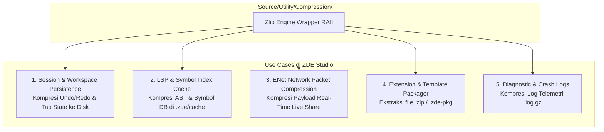

# Dokumen Perencanaan Integrasi zlib untuk ZDE Studio

Dokumen ini memetakan arsitektur, use case utama, struktur folder, antarmuka C++20, dan tahapan implementasi untuk mengintegrasikan **zlib (v1.3.1)** ke dalam ZDE Studio.

---

## 1. Visi & Use Case Utama zlib di ZDE Studio

`zlib` adalah standar industri untuk kompresi dan dekompresi lossless (**Deflate / Inflate / Gzip**). Di ZDE Studio, zlib digunakan untuk:



---

## 2. Struktur Folder & File yang Akan Dibuat

Komponen kompresi akan diletakkan di dalam modul utility terpusat:

```text
Source/
├── Utility/
│   ├── Compression/                           # Submodul Kompresi Terpusat
│   │   ├── ZlibCompressor.h                   # Wrapper C++20 RAII (Deflate / Inflate in-memory)
│   │   ├── ZlibCompressor.cpp
│   │   ├── GzipStream.h                       # Stream reader/writer untuk file .gz
│   │   ├── GzipStream.cpp
│   │   ├── ZipArchive.h                       # Parser & extractor file .zip / .zde-pkg
│   │   └── ZipArchive.cpp
│   │
│   └── CMakeLists.txt                         # Target link ke CPM::zlib
```

---

## 3. Rincian Desain Antarmuka C++20 (Header API)

### A. `ZlibCompressor.h` (In-Memory Compression & Decompression)
Menyediakan helper statis dan stream buffer yang aman (*no-leak*):

```cpp
#pragma once

#include <cstdint>
#include <span>
#include <string>
#include <string_view>
#include <vector>
#include <optional>

namespace Zenvra::Utility::Compression {

enum class CompressionLevel {
    Fastest = 1,
    Default = 6,
    Best = 9
};

enum class CompressionFormat {
    RawDeflate, // Format raw deflate (tanpa header zlib)
    Zlib,       // Standar zlib (header + adler32 checksum)
    Gzip        // Standar gzip (header + crc32 checksum)
};

class ZlibCompressor {
public:
    // Kompresi memory buffer byte
    static std::optional<std::vector<std::uint8_t>> compress(
        std::span<const std::uint8_t> input,
        CompressionLevel level = CompressionLevel::Default,
        CompressionFormat format = CompressionFormat::Zlib);

    // Dekompresi memory buffer byte
    static std::optional<std::vector<std::uint8_t>> decompress(
        std::span<const std::uint8_t> compressed_input,
        std::size_t max_uncompressed_limit = 128 * 1024 * 1024, // Proteksi zip bomb (128 MB default)
        CompressionFormat format = CompressionFormat::Zlib);

    // Helper praktis untuk string / JSON
    static std::optional<std::vector<std::uint8_t>> compress_string(
        std::string_view text,
        CompressionLevel level = CompressionLevel::Default);

    static std::optional<std::string> decompress_string(
        std::span<const std::uint8_t> compressed_data);
};

} // namespace Zenvra::Utility::Compression
```

---

### B. `GzipStream.h` (Streaming File Compression)
Untuk membaca dan menulis file terkompresi langsung dari disk:

```cpp
#pragma once

#include <filesystem>
#include <optional>
#include <span>
#include <string>
#include <vector>

namespace Zenvra::Utility::Compression {

class GzipFile {
public:
    // Menulis file langsung dalam format .gz (misal: .zde/logs/session.log.gz)
    static bool write_file(
        const std::filesystem::path& destination_path,
        std::span<const std::uint8_t> data);

    // Membaca dan otomatis mendekompresi file .gz dari disk
    static std::optional<std::vector<std::uint8_t>> read_file(
        const std::filesystem::path& source_path);
};

} // namespace Zenvra::Utility::Compression
```

---

## 4. Titik Integrasi (Integration Touchpoints) di ZDE Studio

### 1. 💾 **Session & Undo/Redo Persistence (`.zde/session.dat`)**
* **Masalah**: Undo history teks panjang dan terminal scrollback (puluhan ribu baris) menghabiskan ruang disk dan lambat disimpan jika teks mentah.
* **Solusi zlib**: Data state di-serialize ke JSON/binary lalu di-`compress()`. Ukuran disk berkurang **80%–90%** dan I/O disk menjadi instan.

### 2. ⚡ **LSP Symbol Index & Compile Commands Cache**
* **Masalah**: Cache database simbol AST C++/Rust bisa memakan puluhan MB di folder `.zde/cache/`.
* **Solusi zlib**: File cache disimpan dalam format `.zlib` terkompresi.

### 3. 🌐 **Kompresi Paket Network ENet (Live Share)**
* **Masalah**: Saat mengirimkan file source code besar atau full AST tree ke rekan pair programming melalui jaringan internet.
* **Solusi zlib**: Payload teks dikompresi dengan `CompressionLevel::Fastest` sebelum dikirimkan via ENet channel, menghemat bandwidth jaringan dan menurunkan latensi.

### 4. 📦 **Extension & Project Template Extractor (`.zde-extension` / `.zip`)**
* Membaca dan mengekstrak template proyek baru (C++ CMake Template, Python Starter, dll.) dari bundle file zip terkompresi bawaan IDE.

---

## 5. Rencana Tahapan Eksekusi (Checklist Roadmap)

### 📌 **Tahap 1: CMake Linking & Wrapper Foundation**
- [ ] Verifikasi target `zlib` / `zlibstatic` di `Cmake/Depedencies.cmake`.
- [ ] Implementasikan `Source/Utility/Compression/ZlibCompressor.h` dan `.cpp`.
- [ ] Buat unit test di `Tests/CompressionTests.cpp` (uji kompresi string, buffer biner, round-trip correctness, dan proteksi dekompresi buffer corrupted).

### 📌 **Tahap 2: Gzip Stream & Log Management**
- [ ] Implementasikan `Source/Utility/Compression/GzipStream.h` dan `.cpp`.
- [ ] Integrasikan kompresi log otomatis pada crash logger atau log session terminal saat ZDE ditutup.

### 📌 **Tahap 3: Session Snapshot Compression**
- [ ] Hubungkan `ZlibCompressor` ke `EditorSessionModel` untuk menyimpan status tab, kursor, dan workspace layout.

### 📌 **Tahap 4: ENet Network Integration**
- [ ] Pasang kompresi Deflate otomatis pada paket data besar di layer transport ENet ZDE Studio.
