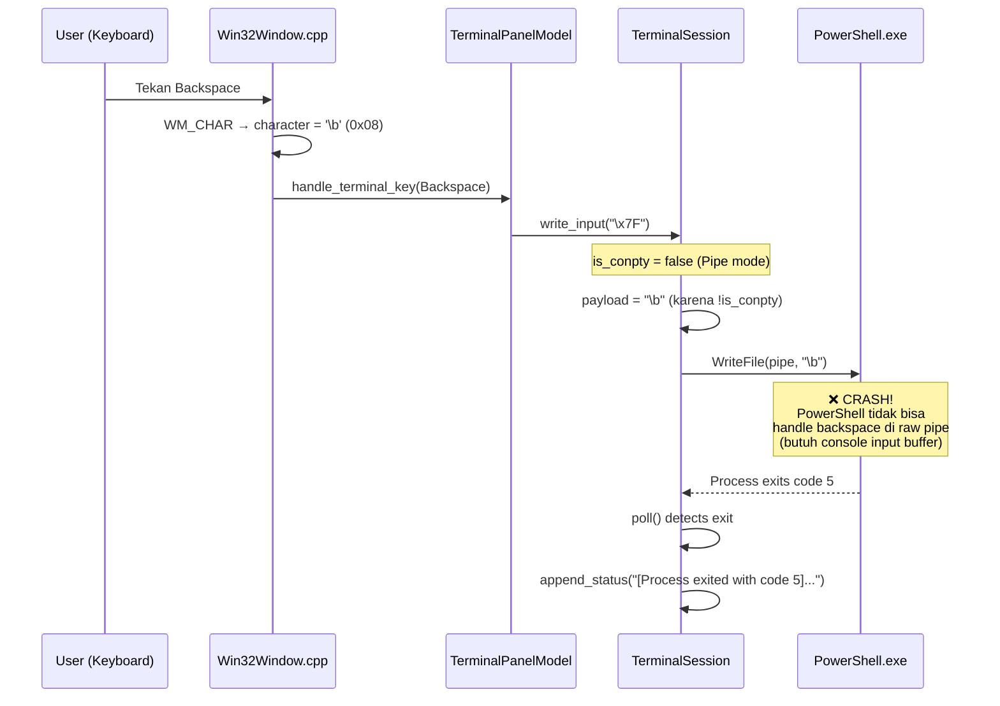

# Analisis: Terminal Session Crash Saat Backspace (Exit Code 5, Pipe Mode)

## TL;DR — Root Cause

**Masalah utama: Terminal jalan di Pipe mode (bukan ConPTY), dan PowerShell tidak bisa handle backspace (`\b`) di raw pipe karena tidak ada pseudoconsole yang mengatur line-editing.**

Exit code **5** = `ERROR_ACCESS_DENIED` — PowerShell crash/exit karena mencoba melakukan console-level operation (edit input buffer) tapi pipe tidak punya console handle.

---

## Alur Kejadian Step-by-Step



---

## Detail Teknis Per Layer

### 1. Win32Window.cpp — Input Dispatch
[Win32Window.cpp:L2321-L2326](file:///c:/Users/Administrator/Documents/Projects/ZDE-minimal/Source/Platform/Win32/Win32Window.cpp#L2321-L2326)

```cpp
} else if (character == L'\b') {
    changed = m_workspace_renderer.handle_terminal_key(
        Terminal::TerminalInputKey::Backspace);
} else if (character == 0x7F) {
    changed = m_workspace_renderer.handle_terminal_key(
        Terminal::TerminalInputKey::DeleteWordBackward);
```

Win32 `WM_CHAR` memberikan `\b` (0x08) untuk backspace → diteruskan sebagai `TerminalInputKey::Backspace`.

### 2. TerminalPanelModel.cpp — Key Translation
[TerminalPanelModel.cpp:L152-L153](file:///c:/Users/Administrator/Documents/Projects/ZDE-minimal/Source/Terminal/TerminalPanelModel.cpp#L152-L153)

```cpp
case TerminalInputKey::Backspace:
    return session->write_input("\x7F");
```

Selalu mengirim `\x7F` (DEL) ke `write_input()`.

### 3. TerminalSession::write_input() — The Critical Decision Point
[TerminalSession.cpp:L972-L984](file:///c:/Users/Administrator/Documents/Projects/ZDE-minimal/Source/Terminal/TerminalSession.cpp#L972-L984)

```cpp
#if defined(_WIN32)
  if (m_implementation->input_write != nullptr) {
    std::string payload(text);
    if (is_backspace) {
      payload = m_implementation->is_conpty ? "\x7F" : "\b";  // ← INI MASALAHNYA
    } else if (!m_implementation->is_conpty) {
      if (payload == "\r") {
        payload = "\r\n";
      }
    }

    DWORD bytes_written = 0;
    const BOOL succeeded =
        WriteFile(m_implementation->input_write, payload.data(),
                  static_cast<DWORD>(payload.size()), &bytes_written, nullptr);
```

> [!CAUTION]
> **Ini titik kritis.** Ketika `is_conpty = false` (Pipe mode), backspace dikirim sebagai `\b` (0x08) langsung ke stdin pipe PowerShell. Tapi PowerShell **butuh console input buffer** (yang disediakan oleh ConPTY/real console) untuk memproses backspace. Di raw pipe, `\b` hanya sebuah control character tanpa makna editing — PowerShell tidak punya mekanisme untuk "hapus karakter terakhir" di pipe mode.

### 4. Kenapa Pipe Mode?
[TerminalSession.cpp:L696-L700](file:///c:/Users/Administrator/Documents/Projects/ZDE-minimal/Source/Terminal/TerminalSession.cpp#L696-L700)

```
// Step 2: ConPTY failed or shell died in ConPTY -> Attempt Pipe mode fallback
```

Terminal sudah fallback ke Pipe mode, kemungkinan karena:
- ConPTY `CreatePseudoConsole` gagal di sistem ini
- `s_conpty_permanently_failed` = true (karena early crash sebelumnya)
- Self-healing mechanism ([L1076-L1084](file:///c:/Users/Administrator/Documents/Projects/ZDE-minimal/Source/Terminal/TerminalSession.cpp#L1076-L1084)) memicu permanent ConPTY disable

### 5. Exit Code 5
[TerminalExitDecoder.cpp:L108-L122](file:///c:/Users/Administrator/Documents/Projects/ZDE-minimal/Source/Terminal/TerminalExitDecoder.cpp#L108-L122)

Exit code 5 bukan NTSTATUS, masuk ke branch generic:
```
"[Process exited with code 5] — Shell: "C:\Windows\System32\...\powershell.exe" (Pipe mode)"
```

**Exit code 5 = `ERROR_ACCESS_DENIED`** di Win32. PowerShell gagal saat mencoba mengakses console input buffer yang tidak ada di pipe mode.

---

## Kenapa Ini Terjadi?

| Aspek | ConPTY Mode ✅ | Pipe Mode ❌ |
|-------|---------------|-------------|
| Console buffer | Ada (pseudoconsole) | Tidak ada |
| Backspace handling | OS handles line-editing | Karakter mentah ke stdin |
| PowerShell readline | Berfungsi normal | Tidak bisa edit line |
| `\b` / `\x7F` | Diteruskan ke console API | Raw byte, no meaning |
| Arrow keys, Tab | Escape sequences diproses | Escape sequences raw |

**PowerShell (dan cmd.exe) adalah "cooked mode" applications** — mereka bergantung pada Windows Console subsystem untuk line editing (backspace, arrow keys, history). Tanpa console (ConPTY atau real console), mereka tidak bisa melakukan operasi dasar seperti menghapus karakter.

---

## Ringkasan Akhir

> [!IMPORTANT]
> **Penyebab crash = Terminal berjalan di Pipe mode (fallback dari ConPTY yang gagal), dan PowerShell tidak bisa memproses backspace di raw pipe karena tidak ada console input buffer.**
>
> Solusi yang benar: **Perbaiki ConPTY agar tidak gagal**, atau jika memang harus Pipe mode, jangan kirim `\b`/`\x7F` langsung — lakukan line-editing secara internal (intercept backspace di `TerminalSession`, manipulasi `m_pending_input`, lalu kirim ulang seluruh line setelah di-edit).
>
> Alternatif quick-fix: Di `navigate_history()` dan `write_input()`, ketika Pipe mode, intercept backspace sepenuhnya di sisi ZDE (jangan kirim ke shell sama sekali), dan gunakan pendekatan "clear line + rewrite" (`\r` + spaces + `\r` + new text) untuk mengedit input yang sudah tertulis di terminal.
